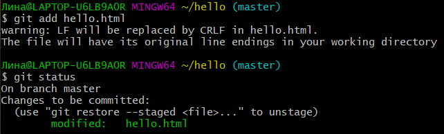
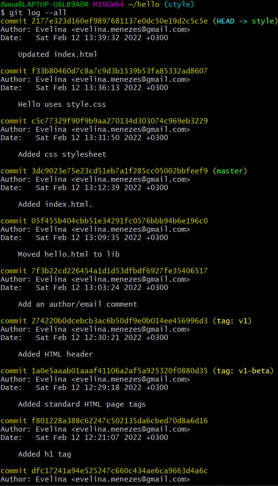

##### РОССИЙСКИЙ УНИВЕРСИТЕТ ДРУЖБЫ НАРОДОВ

##### Факультет физико-математических и естественных наук Кафедра прикладной информатики и теории вероятностей

### ОТЧЕТ ПО ЛАБОРАТОРНОЙ РАБОТЕ №1

дисциплина: *Математическое моделирование*

Студент: Бронникова Де Менезеш Эвелина

Группа: НФИбд-01-19

МОСКВА

2022 г.

##### ЦЕЛЬ РАБОТЫ
Преобрести практические навыки работы с git.

##### ПОСЛЕДОВАТЕЛЬНОСТЬ ВЫПОЛНЕНИЯ РАБОТА
##### **1.1** **Подготовка**

  **1.1.1** **Установка имени и электронной почты**

  Установка git и последовательно имени и электронной почты с выполнением команд:

        git config --global user.name "Your Name"
        git config --global user.email "your_email@whatever.com"

  **1.1.2 Параметры установки окончаний строк**

  Настройка *core.autocrlf* с параметрами *true* и *input* делает все переводы строк текстовых файлов в главном репозитории одинаковы.
core.autocrlf true - git автоматически конвертирует CRLF->LF при коммите и обратно LF->CRLF при выгрузке кода из репозитория на файловую систему
(используют в Windows). Если core.safecrlf установлен в true или warm, git проверяет, если преобразование является обратимым для текущей настройки core.autocrlf.
core.safecrlf true - отвержение необратимого преобразования lf<->crlf.
Полезно, когда специфические бинарники похожие на текстовые файлы.
core.safecrlf warn - печать только предупреждение, но принимает необратимый переход.
Для пользователей Windows:

    git config --global core.autocrlf true
    git config --global core.safecrlf true

  **1.1.3 Установка отображения unicode**

  По умолчанию, git будет печатать не-ASCII символов в именах файлов в виде восьмеричных последовательностей \nnn. Чтобы избежать нечитаемых строк, установливается соответствующий флаг.

    git config --global core.quotepath off

##### **1.2 Создание проекта**
  **1.2.1 Создайте страницу «Hello, World»**

  Работа начинается в пустом рабочем каталоге с создания пустого каталога с именем *hello*, затем перемещаемся в него и создатся там файл с именем *hello.html*.

    mkdir hello
    cd hello
    touch hello.html
    echo "Hello, World!" > hello.html

  **1.2.2 Создание репозитория**

  Чтобы создать git репозиторий из этого каталога, выполняется команда

    git init

  

  **1.2.3 Добавление файла в репозиторий**

  Добавляется файл в репозиторий.

    git add hello.html
    git commit -m "Initial Commit"

  
  

  **1.2.4 Проверка состояния репозитория**

  Используется команда *git status*, чтобы проверить текущее состояние репозитория.

  

  Команда проверки состояния сообщает, что коммитить нечего. Это означает, что в репозитории хранится текущее состояние рабочего каталога, и нет никаких изменений, ожидающих записи.

##### **1.3 Внесение изменений**
  **1.3.1 Измените страницу «Hello, World»**

  Добавляются кое-какие HTML-теги к нашему приветствию. Изменяется содержимое файла *hello.html* на:

    <h1>Hello, World!</h1>

  И проверяется состояние рабочего каталога.

    git status

  

#####  **1.4 Индексация изменений**

  Теперь выполните команду git, чтобы проиндексировать изменения. Проверьте состояние.

    git add hello.html
    git status

  

  Изменения файла *hello.html* были проиндексированы. Это означает, что git теперь знает об изменении, но изменение пока не записано в репозиторий. Следующий коммит будет включать в себя проиндексированные изменения.

  **1.4.1 Коммит изменений**

  Сделайте коммит и проверьте состояние.

    git commit

  Откроется редактор.
  В первой строке введите комментарий: «Added h1 tag». Сохраните файл и выйдите из редактора (для этого в редакторе по-умолчанию (Vim) вам нужно нажать
  клавишу ESC, ввести :wq и нажать Enter).
  Теперь еще раз проверим состояние.

    
  Рабочий каталог чистый, можно продолжить работу.

  **1.4.2 Добавьте стандартные теги страницы**
  Измените страницу «Hello, World», чтобы она содержала стандартные теги <html>
  и <body>.

    <html>
    <body>
    <h1>Hello, World!</h1>
    </body>
    </html>
  Теперь добавьте это изменение в индекс git.
  git add hello.html
  Теперь добавьте заголовки HTML (секцию <head>) к странице «Hello, World».

  <html>
   <head>
   </head>
    <body>
     <h1>Hello, World!</h1>
   </body>
  </html>
  Проверьте текущий статус:
  git status
  Обратите внимание на то, что hello.html указан дважды в состоянии. Первое изменение (добавление стандартных тегов) проиндексировано и готово к
  коммиту. Второе изменение (добавление заголовков HTML) является непроиндексированным. Если бы вы делали коммит сейчас, заголовки не были бы сохранены
  в репозиторий.
  Произведите коммит проиндексированного изменения (значение по умолчанию), а затем еще раз проверьте состояние.
  git commit -m "Added standard HTML page tags"
  git status
  Состояние команды говорит о том, что hello.html имеет незафиксированные
  изменения, но уже не в буферной зоне.
  Теперь добавьте второе изменение в индекс, а затем проверьте состояние с
  помощью команды git status.
  git add .
  git status
  В качестве файла для добавления, мы использовали текущий каталог (.). Это
  краткий и удобный путь для добавления всех изменений в файлы текущего каталога
  и его подкаталоги. Но поскольку он добавляет все, не лишним будет проверить
  состояние перед запуском add, просто чтобы убедиться, что вы не добавили какойто файл, который добавлять было не нужно.
  Второе изменение было проиндексировано и готово к коммиту.
  Сделайте коммит второго изменения
  git commit -m "Added HTML header"

  **1.4.3 История**
  Получим список произведенных изменений:
  git log

  Однострочный формат истории:
  git log --pretty=oneline
  Есть много вариантов отображения лога.

    git log --pretty=oneline --max-count=2
    git log --pretty=oneline --since='5 minutes ago'
    git log --pretty=oneline --until='5 minutes ago'
    git log --pretty=oneline --author=<your name>
    git log --pretty=oneline --all

  Справочная страница:
  man git-log
  Инструмент gitk полезен в изучении истории изменений.
  

**1.4.4 Получение старых версий**

  Возвращаться назад в историю очень просто. Команда checkout скопирует любой
  снимок из репозитория в рабочий каталог.
  Получите хэши предыдущих версий
  git log
  Изучите данные лога и найдите хэш для первого коммита. Он должен быть в
  последней строке данных. Используйте этот хэш-код (достаточно первых 7 знаков)
  в команде ниже. Затем проверьте содержимое файла hello.html.

    git checkout <hash>
    cat hello.html

  Вернитесь к последней версии в ветке master

  git checkout master
  cat hello.html
  master — имя ветки по умолчанию. Переключая имена веток, вы попадаете на
  последнюю версию выбранной ветки.
  

**1.4.5 Создание тегов версий**

  Давайте назовем текущую версию страницы hello первой (v1).
  Создайте тег первой версии
  git tag v1
  Теперь текущая версия страницы называется v1.
  Теги для предыдущих версий Давайте создадим тег для версии, которая идет
  перед текущей версией и назовем его v1-beta. В первую очередь нам надо переключиться на предыдущую версию. Вместо поиска до хэш, мы будем использовать
  ^, обозначающее «родитель v1». Вместо обозначения v1^ можно использовать
  v1~1. Это обозначение можно определить как «первую версию предшествующую
  v1».
  git checkout v1^
  cat hello.html
  Это версия c тегами <html> и <body>, но еще пока без <head>. Давайте сделаем
  ее версией v1-beta.
  git tag v1-beta
  

  **1.4.6 Переключение по имени тега**

  Теперь попробуйте попереключаться между двумя отмеченными версиями.
  git checkout v1
  git checkout v1-beta
  
  **1.4.7 Просмотр тегов с помощью команды tag**

  Вы можете увидеть, какие теги доступны, используя команду git tag.
  git tag
  Вы также можете посмотреть теги в логе.
  git log master --all
  Вы можете видеть теги (v1 и v1-beta) в логе вместе с именем ветки (master).
  Кроме того HEAD показывает коммит, на который вы переключились (на данный
  момент это v1-beta).
  

##### **1.5 Отмена локальных изменений (до индексации)**
  **1.5.1 Переключитесь на ветку master**

  Убедитесь, что вы находитесь на последнем коммите ветки master, прежде чем
  продолжить работу.
  git checkout master
  

  **1.5.2 Измените hello.html**

  Иногда случается, что вы изменили файл в рабочем каталоге, и хотите отменить
  последние коммиты. С этим справится команда git checkout.
  Внесите изменение в файл hello.html в виде нежелательного комментария.

      <html>
      <head>
      </head>
      <body>
      <h1>Hello, World!</h1>
      <!-- This is a bad comment. We want to revert it. -->
      </body>
      </html>

  

  **1.5.3 Проверьте состояние**

  Сначала проверьте состояние рабочего каталога.
  git status
  Мы видим, что файл hello.html был изменен, но еще не проиндексирован.
  1.5.4 Отмена изменений в рабочем каталоге
  Используйте команду git checkout для переключения версии файла
  hello.html в репозитории.
  git checkout hello.html
  git status
  cat hello.html
  Команда git status показывает нам, что не было произведено никаких изменений, не зафиксированных в рабочем каталоге.
  
#####  **1.6 Отмена проиндексированных изменений (перед коммитом)**
  **1.6.1 Измените файл и проиндексируйте изменения**
  Внесение изменений в файл *hello.html* в виде нежелательного комментария

    <html>
    <head>
    <!-- This is an unwanted but staged comment -->
    </head>
    <body>
    <h1>Hello, World!</h1>
    </body>
    </html>

  Ииндексация этого изменения.

    git add hello.html
  
  **1.6.2 Проверка состояния**
  Проверьте состояние нежелательного изменения.
  git status
  Состояние показывает, что изменение было проиндексировано и готово к коммиту.
  

  **1.6.3 Выполните сброс буферной зоны**

  К счастью, вывод состояния показывает нам именно то, что мы должны сделать
  для отмены индексации изменения.
  git reset HEAD hello.html
  Команда git reset сбрасывает буферную зону к HEAD. Это очищает буферную
  зону от изменений, которые мы только что проиндексировали.
  Команда git reset (по умолчанию) не изменяет рабочий каталог. Поэтому
  рабочий каталог все еще содержит нежелательный комментарий. Мы можем использовать команду git checkout, чтобы удалить нежелательные изменения в
  рабочем каталоге.
  

  **1.6.4 Переключитесь на версию коммита**
  git checkout hello.html
  git status
  Наш рабочий каталог опять чист.

#####  **1.7 Отмена коммитов**
  **1.7.1 Отмена коммитов**
  Иногда вы понимаете, что новые коммиты являются неверными, и хотите их
  отменить. Есть несколько способов решения этого вопроса, здесь мы будем использовать самый безопасный.
  Мы отменим коммит путем создания нового коммита, отменяющего нежелательные изменения.

**1.7.2 Измените файл и сделайте коммит**

  Измените файл hello.html на следующий.
  <html>
  <head>
  </head>
  <body>
  <h1>Hello, World!</h1>
  <!-- This is an unwanted but committed change -->
  </body>
  </html>
  Выполните:
  git add hello.html
  git commit -m "Oops, we didn't want this commit"

**1.7.3 Сделайте коммит с новыми изменениями, отменяющими предыдущие**

  Чтобы отменить коммит, нам необходимо сделать коммит, который удаляет изменения, сохраненные нежелательным коммитом.
  git revert HEAD
  Перейдите в редактор, где вы можете отредактировать коммит-сообщение по
  умолчанию или оставить все как есть. Сохраните и закройте файл.
  Так как мы отменили самый последний произведенный коммит, мы смогли
  использовать HEAD в качестве аргумента для отмены. Мы можем отменить любой
  произвольной коммит в истории, указав его хэш-значение.
  
  **1.7.4 Проверьте лог**
  Проверка лога показывает нежелательные и отмененные коммиты в наш репозиторий.

  git log
  Эта техника будет работать с любым коммитом.
  
#####  **1.8 Удаление коммиттов из ветки**
  git revert является мощной командой, которая позволяет отменить любые коммиты в репозиторий. Однако, и оригинальный и «отмененный» коммиты видны в
  истории ветки (при использовании команды git log).
  Часто мы делаем коммит, и сразу понимаем, что это была ошибка. Было бы
  неплохо иметь команду «возврата», которая позволила бы нам сделать вид, что
  неправильного коммита никогда и не было. Команда «возврата» даже предотвратила бы появление нежелательного коммита в истории git log.

  **1.8.1 Команда git reset**

  При получении ссылки на коммит (т.е. хэш, ветка или имя тега), команда git
  reset:
  • перепишет текущую ветку, чтобы она указывала на нужный коммит;
  • опционально сбросит буферную зону для соответствия с указанным коммитом;
  • опционально сбросит рабочий каталог для соответствия с указанным коммитом.

  **1.8.2 Проверьте нашу историю**

  Давайте сделаем быструю проверку нашей истории коммитов. Выполните:
  git log
  Мы видим, что два последних коммита в этой ветке — «Oops» и «Revert Oops».
  Давайте удалим их с помощью сброса.
  
  **1.8.3 Для начала отметьте эту ветку**
  Но прежде чем удалить коммиты, давайте отметим последний коммит тегом, чтобы
  потом можно было его найти.
  git tag oops
   
 
  **1.8.4 Сброс коммитов к предшествующим коммиту Oops**
 
  Глядя на историю лога, мы видим, что коммит с тегом «v1» является коммитом,
  предшествующим ошибочному коммиту. Давайте сбросим ветку до этой точки.
  Поскольку ветка имеет тег, мы можем использовать имя тега в команде сброса
  (если она не имеет тега, мы можем использовать хэш-значение).
  git reset --hard v1
  git log
  Наша ветка master теперь указывает на коммит v1, а коммитов Oops и Revert
  Oops в ветке уже нет. Параметр --hard указывает, что рабочий каталог должен
  быть обновлен в соответствии с новым head ветки.
 
  
 **1.8.5 Ничего никогда не теряется**
  Что же случается с ошибочными коммитами? Оказывается, что коммиты все еще
  находятся в репозитории. На самом деле, мы все еще можем на них ссылаться.
  Помните, в начале этого урока мы создали для отмененного коммита тег «oops».
  Давайте посмотрим на все коммиты.
  git log --all
  Мы видим, что ошибочные коммиты не исчезли. Они все еще находятся в репозитории. Просто они отсутствуют в ветке master. Если бы мы не отметили их
  тегами, они по-прежнему находились бы в репозитории, но не было бы никакой
  возможности ссылаться на них, кроме как при помощи их хэш имен. Коммиты, на
  которые нет ссылок, остаются в репозитории до тех пор, пока не будет запущен
  сборщик мусора.
 
  **1.8.6 Опасность сброса**
  Сброс в локальных ветках, как правило, безопасен. Последствия любой «аварии»
  как правило, можно восстановить простым сбросом с помощью нужного коммита.
  Однако, если ветка «расшарена» на удаленных репозиториях, сброс может сбить с
  толку других пользователей ветки.
 
#####  **1.9 Удаление тега oops**
  **1.9.1 Удаление тега oops**
 
  Тег oops свою функцию выполнил. Давайте удалим его и коммиты, на которые он
  ссылался, сборщиком мусора.

  git tag -d oops
  git log --all
  Тег «oops» больше не будет отображаться в репозитории.
 
#####  **1.10 Внесение изменений в коммиты**
  **1.10.1 Измените страницу, а затем сделайте коммит**
  Добавьте в страницу комментарий автора (вставьте свою фамилию).
  <!-- Author: Dmitry S. Kulyabov -->
  <html>
  <head>
  </head>
  <body>
  <h1>Hello, World!</h1>
  </body>
  </html>
  Выполните:
  git add hello.html
  git commit -m "Add an author comment"
 
 
**1.10.2 Необходим email**
  После совершения коммита вы понимаете, что любой хороший комментарий должен включать электронную почту автора. Обновите страницу hello, включив в нее email.

    <!-- Author: Dmitry S. Kulyabov (kulyabov-ds@rudn.ru) -->
    <html>
    <head>
    </head>
    <body>
    <h1>Hello, World!</h1>
    </body>
    </html>

  **1.10.3 Измените предыдущий коммит**

  Мы действительно не хотим создавать отдельный коммит только ради электронной
  почты. Давайте изменим предыдущий коммит, включив в него адрес электронной
  почты.
  Выполните:

    git add hello.html
    git commit --amend -m "Add an author/email comment"

 
  **1.10.4 Просмотр истории**

  Выполните:
  git log
  Мы можем увидеть, что оригинальный коммит «автор» заменен коммитом «автор/email». Этого же эффекта можно достичь путем сброса последнего коммита в
  ветке, и повторного коммита новых изменений.
 
 
#####  **1.11 Перемещение файлов**
  **1.11.1 Переместите файл hello.html в каталог lib**
 
  Сейчас мы собираемся создать структуру нашего репозитория. Давайте перенесем
  страницу в каталог lib.

    mkdir lib
    git mv hello.html lib
    git status

  Перемещая файлы с помощью git mv, мы информируем git о 2 вещах:
  • Что файл hello.html был удален.
  • Что файл lib/hello.html был создан.
  • Оба эти факта сразу же проиндексированы и готовы к коммиту. Команда git
  status сообщает, что файл был перемещен.

 
#####  **1.12 Второй способ перемещения файлов**

  Положительной чертой git является то, что вы можете забыть о версионном контроле до того момента, когда вы готовы приступить к коммиту кода. Что бы случилось, если бы мы использовали командную строку операционной системы для
  перемещения файлов вместо команды git?
  Следующий набор команд идентичен нашим последним действиям. Работы
  здесь побольше, но результат тот же.
  Мы могли бы выполнить:

      mkdir lib
      mv hello.html lib
      git add lib/hello.html
      git rm hello.html

**1.12.1 Коммит в новый каталог**

  Давайте сделаем коммит этого перемещения:
  git commit -m "Moved hello.html to lib"
 
#####  **1.13 Подробнее о структуре**
**1.13.1 Добавление index.html**
 
  Добавим файл index.html в наш репозиторий
  <html>
  <body>
  <iframe src="lib/hello.html" width="200" height="200" />
  </body>
  </html>
  Добавьте файл и сделайте коммит.
  git add index.html
  git commit -m "Added index.html."
  Теперь при открытии index.html, вы должны увидеть кусок страницы hello в
  маленьком окошке.
 
#####  **1.14 Git внутри: Каталог .git**
  **1.14.1 Каталог .git**

  Выполните:
  ls -C .git
  Это каталог, в котором хранится вся информация git.

  **1.14.2 База данных объектов**
  Выполните:
  ls -C .git/objects
  Вы должны увидеть набор каталогов, имена которых состоят из 2 символов. Имена каталогов являются первыми двумя буквами хэша sha1 объекта, хранящегося в
  git.

 
  **1.14.3 Углубляемся в базу данных объектов**
 
  Выполните:
  ls -C .git/objects/<dir>
  Смотрим в один из каталогов с именем из 2 букв. Вы увидите файлы с именами
  из 38 символов. Это файлы, содержащие объекты, хранящиеся в git. Они сжаты и
  закодированы, поэтому просмотр их содержимого нам мало чем поможет.
 
 
  **1.14.4 Config File**
 
  Выполните:
  cat .git/config
  Это файл конфигурации, создающийся для каждого конкретного проекта. Записи
  в этом файле будут перезаписывать записи в файле .gitconfig вашего главного
  каталога, по крайней мере в рамках этого проекта.
 
  **1.14.5 Ветки и теги**
  Выполните:
  ls .git/refs
  ls .git/refs/heads
  ls .git/refs/tags
  cat .git/refs/tags/v1
  Вы должны узнавать файлы в подкаталоге тегов. Каждый файл соответствует
  тегу, ранее созданному с помощью команды git tag. Его содержание — это всего
  лишь хэш коммита, привязанный к тегу.
  Каталог heads практически аналогичен, но используется для веток, а не тегов.
  На данный момент у нас есть только одна ветка, так что все, что вы увидите в этом
  каталоге – это ветка master.
 
 
  **1.14.6 Файл HEAD**
 
  Выполните:
  cat .git/HEAD
  Файл HEAD содержит ссылку на текущую ветку, в данный момент это должна
  быть ветка master.

#####  **1.15 Работа непосредственно с объектами git**
  **1.15.1 Поиск последнего коммита**

  Выполните:
  git log --max-count=1
  Эта команда должна показать последний коммит в репозиторий. SHA1 хэш в
  вашей системе, вероятно, отличается от моего, но вы увидите что-то наподобие
  этого.

 
  **1.15.2 Вывод последнего коммита с помощью SHA1 хэша**

  Выполните:
  git cat-file -t <hash>
  git cat-file -p <hash>

 
  **1.15.3 Поиск дерева**

  Мы можем вывести дерево каталогов, ссылка на который идет в коммите. Это должно быть описание файлов (верхнего уровня) в нашем проекте (для конкретного
  коммита). Используйте SHA1 хэш из строки «дерева», из списка выше.
  Выполните:
  git cat-file -p <treehash>

 
  **1.15.4 Вывод каталога lib**

  Выполните:
  git cat-file -p <libhash>

 
  **1.15.5 Вывод файла hello.html**

  Выполните:
  git cat-file -p <hellohash>

 
  **1.15.6 Исследуйте самостоятельно**

  Исследуйте git репозиторий вручную самостоятельно. Смотрите, удастся ли вам найти оригинальный файл hello.html с самого первого коммита вручную по ссылкам SHA1 хэша в последнем коммите.

 
#####  **1.16 Создание ветки**
  Пора сделать наш hello world более выразительным. Так как это может занять некоторое время, лучше переместить эти изменения в отдельную ветку, чтобы  изолировать их от изменений в ветке master.

  **1.16.1 Создайте ветку**

  Давайте назовем нашу новую ветку «style».
  Выполните:

    git checkout -b style
    git status

  *git checkout -b <имя_ветки>* является шорткатом для git branch
  <имя_ветки> за которым идет git checkout <имя_ветки>.
  Обратите внимание, что команда git status сообщает о том, что вы находитесь в ветке «style».

   
  **1.16.2 Добавьте файл стилей style.css**
  Выполните:
  touch lib/style.css
  Файл lib/style.css:
  h1 {
  color: red;
  }
  Выполните:
  git add lib/style.css
  git commit -m "Added css stylesheet"

   
  **1.16.3 Измените основную страницу**
  Обновите файл hello.html, чтобы использовать стили style.css.

    <!-- Author: Dmitry S. Kulyabov (kulyabov-ds@rudn.ru) -->
    <html>
    <head>
    <link type="text/css" rel="stylesheet"
    media="all" href="style.css" />

    </head>
    <body>
    <h1>Hello, World!</h1>
    </body>
    </html>

  Выполните:
  git add lib/hello.html
  git commit -m "Hello uses style.css"

   
**1.16.4 Измените index.html**

  Обновите файл index.html, чтобы он тоже использовал style.css

    <html>
    <head>
    <link type="text/css" rel="stylesheet"
    media="all" href="lib/style.css" />
    </head>
    <body>
    <iframe src="lib/hello.html" width="200" height="200" />
    </body>
    </html>

  Выполните:
  git add index.html
  git commit -m "Updated index.html"

   
#####  **1.17 Навигация по веткам**

  Теперь в вашем проекте есть две ветки:
  Выполните:
  git log --all

**1.17.1 Переключение на ветку master**
  Используйте команду git checkout для переключения между ветками:
  git checkout master
  cat lib/hello.html
  Сейчас мы находимся на ветке master. Это заметно по тому, что файл
  hello.html не использует стили style.css.

  **1.17.2 Вернемся к ветке style**

  Выполните:
  git checkout style
  cat lib/hello.html
  Содержимое lib/hello.html подтверждает, что мы вернулись на ветку style.
   
#####  **1.18 Изменения в ветке master**
  Пока вы меняли ветку style, кто-то решил обновить ветку master. Они добавили
  файл README.md.

**1.18.1 Создайте файл README в ветке master**

  Выполните:
  git checkout master
  Создайте файл README.md
  echo "This is the Hello World example from the git tutorial." > README.md

#####  **1.19 Сделайте коммит изменений README.md в ветку master.**
  Выполните:
  git add README.md
  git commit -m "Added README"

**1.19.1 Просмотр отличающихся веток**

**1.19.2 Просмотрите текущие ветки**

  Теперь у нас в репозитории есть две отличающиеся ветки. Используйте следующую
  лог-команду для просмотра веток и их отличий.
  Выполните:
  git log --graph --all
  Добавление опции --graph в git log вызывает построение дерева коммитов
  с помощью простых ASCII символов. Мы видим обе ветки (style и master), и то,
  что ветка master является текущей HEAD. Общим предшественником обеих веток
  является коммит «Added index.html».
  Опция --all гарантированно означает, что мы видим все ветки. По умолчанию
  показывается только текущая ветка.

#####  **1.20 Слияние**
**1.20.1 Слияние веток**
  Слияние переносит изменения из двух веток в одну. Давайте вернемся к ветке
  style и сольем master с style.
  Выполните:
  git checkout style
  git merge master
  git log --graph --all
  Путем периодического слияния ветки master с веткой style вы можете переносить из master любые изменения и поддерживать совместимость изменений
  style с изменениями в основной ветке.
  Но что если изменения в ветке master конфликтуют с изменениями в style?

#####  **1.21 Создание конфликта**

**1.21.1 Вернитесь в master и создайте конфликт**
  Вернитесь в ветку master и внесите следующие изменения:

    git checkout master
    Файл lib/hello.html
    <!-- Author: Dmitry S. Kulyabov (dskulyabov@rudn.ru) -->
    <html>
    <head>
    <!-- no style -->
    </head>
    <body>
    <h1>Hello, World! Life is great!</h1>
    </body>
    </html>
    Выполните:
    git add lib/hello.html
    git commit -m 'Life is great'

**1.21.2 Просмотр веток**

  Выполните:
  git log --graph --all
  После коммита «Added README» ветка master была объединена с веткой style,
  но в настоящее время в master есть дополнительный коммит, который не был слит
  с style.
  Последнее изменение в master конфликтует с некоторыми изменениями в
  style. На следующем шаге мы решим этот конфликт.
#####  **1.22 Разрешение конфликтов**

**1.22.1 Слияние master с веткой style**
  Теперь вернемся к ветке style и попытаемся объединить ее с новой веткой
  master.
  Выполните:
  git checkout style
  git merge master
  Если вы откроете lib/hello.html, вы увидите:

    <!-- Author: Dmitry S. Kulyabov (dskulyabov@rudn.ru) -->
    <html>
    <head>
    <<<<<<< HEAD
    <link type="text/css" rel="stylesheet" media="all" href="style.css" />
    =======
    <!-- no style -->
    >>>>>>> master
    </head>
    <body>
    <h1>Hello,World! Life is great!</h1>
    </body>
    </html>

  Первый раздел — версия текущей ветки (style). Второй раздел — версия ветки
  master.

  **1.22.2 Решение конфликта**
  Вам необходимо вручную разрешить конфликт. Внесите изменения в lib/hello.html
  для достижения следующего результата.
  <!-- Author: Dmitry S. Kulyabov (dskulyabov@rudn.ru) -->
  <html>
  <head>
  <link type="text/css" rel="stylesheet"
  media="all" href="style.css" />
  </head>
  <body>
  <h1>Hello, World! Life is great!</h1>
  </body>
  </html>

  **1.22.3 Сделайте коммит решения конфликта**
  Выполните:
  git add lib/hello.html
  git commit -m "Merged master fixed conflict."

  **1.22.4 Перебазирование как альтернатива слиянию**
  Рассмотрим различия между слиянием и перебазированием. Для того, чтобы это  сделать, нам нужно вернуться в репозиторий в момент до первого слияния, а затем  повторить те же действия, но с использованием перебазирования вместо слияния.
  Мы будем использовать команду reset для возврата веток к предыдущему
  состоянию.
#####  **1.23 Сброс ветки style**

  **1.23.1 Сброс ветки style**
  Вернемся на ветке style к точке перед тем, как мы слили ее с веткой master. Мы
  можем сбросить ветку к любому коммиту. По сути, это изменение указателя ветки
  на любую точку дерева коммитов.
  В этом случае мы хотим вернуться в ветке style в точку перед слиянием с master.
  Нам необходимо найти последний коммит перед слиянием.
  Выполните:

    git checkout style
    git log --graph

  Мы видим, что коммит «Updated index.html» был последним на ветке style
  перед слиянием. Давайте сбросим ветку style к этому коммиту.
  Выполните:
  git reset --hard <hash>

  **1.23.2 Проверьте ветку.**
  Поищите лог ветки style. У нас в истории больше нет коммитов слияний.
  Выполните:
  git log --graph --all
#####  **1.24 Сброс ветки master**
  1.24.1 Сброс ветки master
  Добавив интерактивный режим в ветку master, мы внесли изменения, конфликтующие с изменениями в ветке style. Давайте вернемся в ветке master в точку
  перед внесением конфликтующих изменений. Это позволяет нам продемонстрировать работу команды git rebase, не беспокоясь о конфликтах.
  Выполните:
  git checkout master
  git log --graph
  Коммит «Added README» идет непосредственно перед коммитом конфликтующего интерактивного режима. Мы сбросим ветку master к коммиту «Added
  README».
  Выполните:
  git reset --hard <hash>
  git log --graph --all
  Просмотрите лог. Он должен выглядеть, как будто репозиторий был перемотан
  назад во времени к точке до какого-либо слияния.
#####  **1.25 Перебазирование**
  Используем команду rebase вместо команды merge. Мы вернулись в точку до первого слияния и хотим перенести изменения из ветки master в нашу ветку style.
  На этот раз для переноса изменений из ветки master мы будем использовать
  команду git rebase вместо слияния.
  Выполните:
  24
  git checkout style
  git rebase master
  git log --graph
*
**1.25.1 Слияние VS перебазирование**

  Конечный результат перебазирования очень похож на результат слияния. Ветка
  style в настоящее время содержит все свои изменения, а также все изменения
  ветки master. Однако, дерево коммитов значительно отличается. Дерево коммитов ветки style было переписано таким образом, что ветка master является
  частью истории коммитов. Это делает цепь коммитов линейной и гораздо более
  читабельной.
  Не используйте перебазирование:
  • если ветка является публичной и расшаренной, поскольку переписывание
  общих веток будет мешать работе других членов команды;
  • когда важна точная история коммитов ветки, так как команда rebase переписывает историю коммитов;
  Учитывая приведенные выше рекомендации, рекомендуется использовать git
  rebase для кратковременных, локальных веток, а слияние для веток в публичном
  репозитории.
#####  **1.26 Слияние в ветку master**
  Мы поддерживали соответствие ветки style с веткой master (с помощью rebase),
  теперь давайте сольем изменения style в ветку master.
**1.26.1 Слияние style в master**
  Выполните:
  git checkout master
  git merge style
  Поскольку последний коммит ветки master прямо предшествует последнему
  коммиту ветки style, git может выполнить ускоренное слияние-перемотку. При
  быстрой перемотке вперед git просто передвигает указатель вперед, таким образом указывая на тот же коммит, что и ветка style.
  При быстрой перемотке конфликтов быть не может.

**1.26.2 Просмотрите логи**

  Выполните:
  git log
  Теперь ветки style и master идентичны.
#####  **1.27 Клонирование репозиториев**
  **1.27.1 Перейдите в рабочий каталог**

  Перейдите в рабочий каталог и сделайте клон вашего репозитория hello.
  Выполните:
  cd ..
  pwd
  ls
  Сейчас мы находимся в рабочем каталоге.
  В этот момент вы должны находиться в «рабочем» каталоге. Здесь должен быть
  единственный репозиторий под названием «hello».

**1.27.2 Создайте клон репозитория hello**
  Создадим клон репозитория.
  Выполните:
  git clone hello cloned_hello
  ls
  В вашем рабочем каталоге теперь должно быть два репозитория: оригинальный
  репозиторий «hello» и клонированный репозиторий «cloned_hello»
#####  **1.28 Просмотр клонированного репозитория**
  **1.28.1 Давайте взглянем на клонированный репозиторий.**

  Выполните:
  cd cloned_hello
  ls
  Вы увидите список всех файлов на верхнем уровне оригинального репозитория
  README.md, index.html и lib.

  **1.28.2 Просмотрите историю репозитория**
  Выполните:
  git log --all
  Вы увидите список всех коммитов в новый репозиторий, и он должен (более или
  менее) совпадать с историей коммитов в оригинальном репозитории. Единственная разница должна быть в названиях веток.

**1.28.3 Удаленные ветки**

  Вы увидите ветку master (HEAD) в списке истории. Вы также увидите ветки со
  странными именами (origin/master, origin/style и origin/HEAD).

#####  **1.29 Что такое origin?**
  Выполните:
  git remote
  Мы видим, что клонированный репозиторий знает об имени по умолчанию
  удаленного репозитория. Давайте посмотрим, можем ли мы получить более подробную информацию об имени по умолчанию:
  Выполните:
  git remote show origin
  Удаленные репозитории обычно размещаются на отдельной машине, возможно, централизованном сервере. Однако, как мы видим здесь, они могут с тем же
  успехом указывать на репозиторий на той же машине. Нет ничего особенного
  в имени «origin», однако существует традиция использовать «origin» в качестве
  имени первичного централизованного репозитория (если таковой имеется).
#####  **1.30 Удаленные ветки**
  Давайте посмотрим на ветки, доступные в нашем клонированном репозитории.
  Выполните:
  git branch
  Как мы видим, в списке только ветка master. Где ветка style? Команда git
  branch выводит только список локальных веток по умолчанию.

**1.30.1 Список удаленных веток**

  Для того, чтобы увидеть все ветки, попробуйте следующую команду:
  git branch -a
  Git выводит все коммиты в оригинальный репозиторий, но ветки в удаленном
  репозитории не рассматриваются как локальные. Если мы хотим собственную ветку
  style, мы должны сами ее создать. Через минуту вы увидите, как это делается.

  **1.31 Изменение оригинального репозитория**

  Внесите некоторые изменения в оригинальный репозиторий, чтобы затем попытаться извлечь и слить изменения из удаленной ветки в текущую

**1.31.1 Внесите изменения в оригинальный репозиторий hello**

  Выполните:
  cd ../hello
  Примечание: Сейчас мы находимся в репозитории hello
  Внесите следующие изменения в файл README.md:
  Файл README.md
  This is the Hello World example from the git tutorial.
  Теперь добавьте это изменение и сделайте коммит
  Выполните:
  git add README
  git commit -m "Changed README in original repo"
  Теперь в оригинальном репозитории есть более поздние изменения, которых
  нет в клонированной версии. Далее мы извлечем и сольем эти изменения в клонированный репозиторий.
  1.31.2 Извлечение изменений
  Научиться извлекать изменения из удаленного репозитория.
  Выполните:
  cd ../cloned_hello
  git fetch
  git log --all
  28
  Сейчас мы находимся в репозитории cloned_hello.
  На данный момент в репозитории есть все коммиты из оригинального репозитория, но они не интегрированы в локальные ветки клонированного репозитория.
  В истории выше найдите коммит «Changed README in original repo». Обратите
  внимание, что коммит включает в себя коммиты «origin/master» и «origin/HEAD».
  Теперь давайте посмотрим на коммит «Updated index.html». Вы увидите, что
  локальная ветка master указывает на этот коммит, а не на новый коммит, который
  мы только что извлекли.
  Выводом является то, что команда git fetch будет извлекать новые коммиты из удаленного репозитория, но не будет сливать их с вашими наработками в
  локальных ветках.

  **1.31.3 Проверьте README.md**
  Мы можем продемонстрировать, что клонированный файл README.md не изменился.
  Выполните:
  cat README
#####  **1.32 Слияние извлеченных изменений**
**1.32.1 Слейте извлеченные изменения в локальную ветку master**
  Выполните:
  git merge origin/master

**1.32.2 Еще раз проверьте файл README.md**
  Сейчас мы должны увидеть изменения.
  Выполните:
  cat README.md
  Хотя команда git fetch не сливает изменения, мы можем вручную слить изменения из удаленного репозитория.
  Теперь давайте рассмотрим объединение fetch и merge в одну команду. Выполнение:
  git pull
  эквивалентно двум следующим шагам:

    git fetch
    git merge origin/master

#####  **1.33 Добавление ветки наблюдения**
  Ветки, которые начинаются с remotes/origin являются ветками оригинального
  репозитория. Обратите внимание, что у вас больше нет ветки под названием style,
  но система контроля версий знает, что в оригинальном репозитории ветка style
  была.

**1.33.1 Добавьте локальную ветку, которая отслеживает удаленную ветку**

  Выполните:
  git branch --track style origin/style
  git branch -a
  git log --max-count=2
  

  Теперь видна ветка *style* в списке веток и логе.

#####  **1.34 Чистые репозитории**

  Чистые репозитории (без рабочих каталогов) обычно используются для расшаривания. Обычный git-репозиторий подразумевает, что вы будете использовать
  его как рабочую директорию, поэтому вместе с файлами проекта в актуальной
  версии, git хранит все служебные, «чисто-репозиториевские» файлы в поддиректории .git. В удаленных репозиториях нет смысла хранить рабочие файлы на диске
  (как это делается в рабочих копиях), а все что им действительно нужно — это дельты изменений и другие бинарные данные репозитория. Вот это и есть «чистый
  репозиторий».

#####  **1.35 Создайте чистый репозиторий**
    cd ..
    git clone --bare hello hello.git
    ls hello.git

  Как правило, репозитории, оканчивающиеся на .git являются чистыми репозиториями.

  

#####  **1.36 Добавление удаленного репозитория**
  Добавление репозиторий *hello.git* к  оригинальному репозиторию.

    cd hello
    git remote add shared ../hello.git

  
#####  **1.37 Отправка изменений**
  По причине расшаривания чистых репозитории, как правило, в сетевых серверах, необходимо отправить наши изменения в другие репозитории.
  Для этого создается изменения для отправки, редактируйтся файл *README.md* и
  делайтся коммит.

  Файл README.md:

  *This is the Hello World example from the git tutorial.*

  *(Changed in the original and pushed to shared)*

  git checkout master
  git add README
  git commit -m "Added shared comment to readme"

  Далее изменения отправляется в репозиторий, получающий отправленные нами изменения -общий репозиторий.

  git push shared master

  

#####   **1.38 Извлечение общих изменений**

  Переключение в клонированный репозиторий и извлечение изменений, только что отправленных в общий репозиторий.

    cd ../cloned_hello

    git remote add shared ../hello.git
    git branch --track shared master
    git pull shared master
    cat README.md

##### ВЫВОД
В ходе выполнения работы были приобретены практические навыки работы с сокетами.
