##### РОССИЙСКИЙ УНИВЕРСИТЕТ ДРУЖБЫ НАРОДОВ

##### Факультет физико-математических и естественных наук Кафедра прикладной информатики и теории вероятностей

### ОТЧЕТ ПО ЛАБОРАТОРНОЙ РАБОТЕ №1

дисциплина: *Математическое моделирование*

Преподователь: Кулябов Дмитрий Сергеевич

Студент: Бронникова Де Менезеш Эвелина

Группа: НФИбд-01-19

МОСКВА

2022 г.

##### ЦЕЛЬ РАБОТЫ
Приобрести практические навыки работы с git через выполнения задании (пунктов) файла "Работа с Git".

##### ПОСЛЕДОВАТЕЛЬНОСТЬ ВЫПОЛНЕНИЯ РАБОТЫ

##### **1.1** **Подготовка**

  **1.1.1 Установка имени и электронной почты**

  Установка git и последовательно имени и электронной почты с выполнением команд:

        git config --global user.name "Your Name"
        git config --global user.email "your_email@whatever.com"

  **1.1.2 Параметры установки окончаний строк**

  Настройка *core.autocrlf* с параметрами *true* и *input* делает все переводы строк текстовых файлов в главном репозитории одинаковы.
core.autocrlf true - git автоматически конвертирует CRLF->LF при коммите и обратно LF->CRLF при выгрузке кода из репозитория на файловую систему
(используемая в Windows). Если core.safecrlf установлен в true или warm, git проверяет, если преобразование является обратимым для текущей настройки core.autocrlf.
При core.safecrlf true - отвергается необратимое преобразования lf<->crlf.
При core.safecrlf warn - печатается предупреждение, но принимается необратимый переход.
Для пользователей Windows:

    git config --global core.autocrlf true
    git config --global core.safecrlf true

  **1.1.3 Установка отображения unicode**

  По умолчанию, git будет печатать не-ASCII символов в именах файлов в виде восьмеричных последовательностей \nnn. Чтобы избежать нечитаемых строк, устанавливается  соответствующий флаг.

    git config --global core.quotepath off

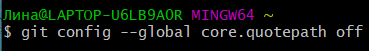

##### **1.2 Создание проекта**

  **1.2.1 Создание страницы «Hello, World»**

  Перед созданием самой страницы создается пустой рабочий каталог с именем *hello*, а затем в нем создастся *hello.html*. Для этого используется следующие команды:

    mkdir hello
    cd hello
    touch hello.html
    echo "Hello, World!" > hello.html

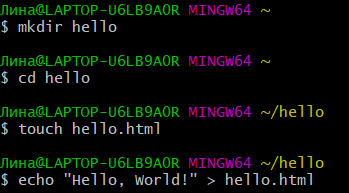

  **1.2.2 Создание репозитория**

  Далее нужно создать git репозиторий из этого каталога, следовательно, выполняется команда:

    git init

  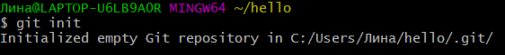

  **1.2.3 Добавление файла в репозиторий**

  Добавляется файл в репозиторий.

    git add hello.html
    git commit -m "Initial Commit"

  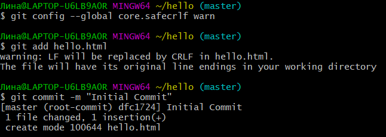

  **1.2.4 Проверка состояния репозитория**

  Используется команда *git status*, чтобы проверить текущее состояние репозитория.

  

  Поскольку команда сообщает, что коммитить нечего, понимается, что в репозитории хранится текущее состояние рабочего каталога, и нет никаких изменений, ожидающих записи.

##### **1.3 Внесение изменений**

  **1.3.1 Измените страницу «Hello, World»**

  Добавляются HTML-теги к нашему приветствию. Изменяется содержимое файла *hello.html* на:

          <h1>Hello, World!</h1>

  И проверяется состояние рабочего каталога.

        git status

  
  

#####  **1.4 Индексация изменений**

  Внесенные изменения стоит проиндексировать. Это позволяет, при необходимости, с легкостью отменить нежеланные изменения. Таким образом используется команда git add, а затем проверяется состояние.

          git add hello.html
          git status

  

  Изменения файла *hello.html* были проиндексированы. Это означает, что git теперь знает об изменении, однако изменение пока не записано в репозиторий.

  **1.4.1 Коммит изменений**

  Выполняется коммит - *git commit*, после чего открывается редактор. На первой строке добавляется комментарий: «Added h1 tag». Редактор закрывается после сохранения файла.

Проверяется состояние.

Так как рабочий каталог чистый, можно продолжить работу.

  **1.4.2 Добавьте стандартные теги страницы**

  Требуется изменить страницу «Hello, World», чтобы она содержала стандартные теги.

     <html>
      <body>
       <h1>Hello, World!</h1>
      </body>
     </html>

 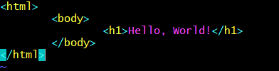

  И проиндексировать изменение.
  git add hello.html

 

 Теперь добавляются заголовки HTML (секцию <head>) к странице «Hello, World».

     <html>
      <head>
      </head>
       <body>
        <h1>Hello, World!</h1>
      </body>
     </html>

 

 Производиться дополнительная проверка текущего статуса - *git status*

 

  Можно заметить, что hello.html указан дважды в состоянии. Первое изменение (добавление стандартных тегов) проиндексировано и готово к  коммиту. Второе изменение (добавление заголовков HTML) является не проиндексированным. Если сделать коммит сейчас, заголовки не были бы сохранены в репозиторий.

  Производится коммит проиндексированного изменения (значение по умолчанию), а затем еще раз проверяется состояние.

  git commit -m "Added standard HTML page tags"
  git status

  Состояние команды говорит о том, что hello.html имеет незафиксированные изменения, но уже не в буферной зоне. Добавляется второе изменение в индекс, а затем проверяется состояние с помощью команды git status.

  git add .
  git status

  В качестве файла для добавления, мы используется текущий каталог (.). Данная запись является
  кратким и удобный способом для добавления всех изменений в файлы текущего каталога
  и его подкаталоги. Тем не менее, стоит учитывать, что таким подходом добавляется все в каталоге, поэтому стоит проверить состояние перед запуском add,  чтобы убедиться, что не присутствуют нежеланные файлы. Таким образом второе изменение было проиндексировано и готово к коммиту.

  git commit -m "Added HTML header"

  **1.4.3 История**
  Получить список произведенных изменений можно через команду:

  git log

 

  Существует множество спобов вывода произведенных изменений - однострочный формат истории, с фильтром по времени изменения и автору:

  git log --pretty=oneline

  

    git log --pretty=oneline --max-count=2
    git log --pretty=oneline --since='5 minutes ago'
    git log --pretty=oneline --until='5 minutes ago'
    git log --pretty=oneline --author=<your name>
    git log --pretty=oneline --all

 

**1.4.4 Получение старых версий**

  При необходимости можно вернутся назад в историю используя команда checkout (которая копирует любой
  снимок из репозитория в рабочий каталог) и хэши предыдущих версий. Для последнего достаточно посмотреть лог.

  git log

 Таким образом, можно найти первый коммит и проверьте содержимое файла *hello.html*.

    git checkout <hash>
    cat hello.html

  

  Для возвращения к последней версии в ветке master (имя ветки по умолчанию) достаточно на неё переключится:

  git checkout master
  cat hello.html

  

**1.4.5 Создание тегов версий**

  В git существует еще одна удобная функция, которая позволяет именовать версии файлов путем создания тегов. К примеру, для обозначения текущей версии страницы hello как первой (v1) использовалось:

  git tag v1

  

  После этого переключились на  предыдущую версию используя ^, обозначающее «родитель v1». Проверяется, что это за версия и называем её v1-beta.

  git checkout v1^
  cat hello.html
  git tag v1-beta

   

  **1.4.6 Переключение по имени тега**

  Можно заметить, что теперь возможно переключаться между двумя отмеченными версиями используя теги.

  git checkout v1
  git checkout v1-beta

  

  **1.4.7 Просмотр тегов с помощью команды tag**

  Просмотр доступных тегов осуществляется командой git tag, а также через просмотр тегов в логе.
  git log master --all

  В последнем случае можно посмотреть на созданные теги (v1 и v1-beta) вместе с именем ветки (master). Кроме того, можно увидеть коммит на который переключились (v1-beta), так как он обозначен - HEAD.

  

##### **1.5 Отмена локальных изменений (до индексации)**

  **1.5.1 Переключитесь на ветку master**

  Переключаемся в последний коммит ветки master, прежде чем продолжить работу.

   git checkout master

  

  **1.5.2 Измените hello.html**

  Бывают случае, когда после изменения файла в рабочем каталоге, необходимо отменить
  последние коммиты. В таком случае также можно использовать команду git checkout. Чтобы это продемонстрировать внеслись изменения в файл *hello.html* в виде нежелательного комментария.

      <html>
      <head>
      </head>
      <body>
      <h1>Hello, World!</h1>
      <!-- This is a bad comment. We want to revert it. -->
      </body>
      </html>

  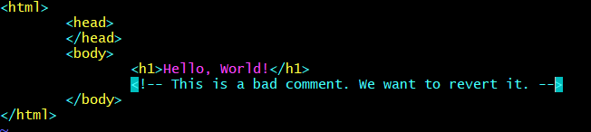

  **1.5.3 Проверьте состояние**

  Вслед за этим, проверяется состояние рабочего каталога.

   git status

  Выводится сообщение о том, что файл hello.html был изменен, но еще не проиндексирован.

   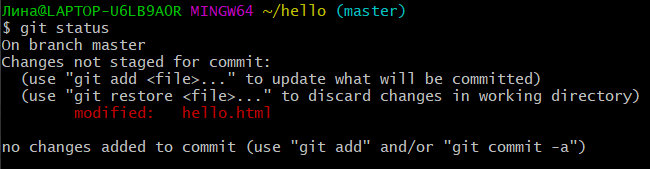

  **1.5.4 Отмена изменений в рабочем каталоге**

  Совершается переключение версии файла hello.html в репозитории.

     git checkout hello.html
     git status
     cat hello.html

  Команда git status подтверждает, что не было произведено никаких изменений, не зафиксированных в рабочем каталоге.

  

#####  **1.6 Отмена проиндексированных изменений (перед коммитом)**

  **1.6.1 Измените файл и проиндексируйте изменения**

  Вносятся изменения в файл *hello.html* в виде нежелательного комментария

      <html>
      <head>
      <!-- This is an unwanted but staged comment -->
      </head>
      <body>
      <h1>Hello, World!</h1>
      </body>
      </html>

  Затем индексируется это изменение.

    git add hello.html

  

  **1.6.2 Проверка состояния**

  Проверяется состояние нежелательного изменения.

    git status

  Состояние показывает, что изменение было проиндексировано и готово к коммиту.

  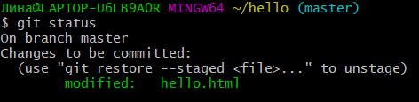

  **1.6.3 Выполнение сброса буферной зоны**

 Теперь очищается буферную зону от изменений, которые только что проиндексировали.

    git reset HEAD hello.html

  Команда git reset сбрасывает буферную зону к HEAD. Учитывая, что эта команда по умолчанию не изменяет рабочий каталог нежелательный комментарий все еще находится в рабочим каталоге. Чтобы его удалить, следующий шаг использование командв git checkout.

  

  **1.6.4 Переключитесь на версию коммита**

    git checkout hello.html
    git status

 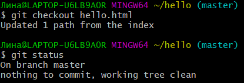

  Теперь рабочий каталог чист.

#####  **1.7 Отмена коммитов**

  **1.7.1 Отмена коммитов**

Не исключено, что новые коммиты являются неверными и их требуется отменить. Есть несколько способов решения этого вопроса. Использовался далее самый безопасный - отмена коммита путем создания нового коммита, отменяющего нежелательные изменения.

**1.7.2 Измените файл и сделайте коммит**

  Сначала изменился файл hello.html на следующий:

     <html>
     <head>
     </head>
     <body>
     <h1>Hello, World!</h1>
     <!-- This is an unwanted but committed change -->
     </body>
     </html>

 

 И выполняется коммит.

    git add hello.html
    git commit -m "Oops, we didn't want this commit"

Таким образом получает нежеланный коммит.

**1.7.3 Сделайте коммит с новыми изменениями, отменяющими предыдущие**

  Чтобы отменить коммит, необходимо сделать коммит, который удаляет изменения, сохраненные нежелательным коммитом.

  git revert HEAD

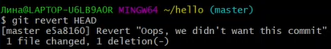

  После этой команды открывается редактор, где можно отредактировать коммит-сообщение по
  умолчанию или оставить все как есть. Решилось ничего не изменять. Для отмены можно использовать
  произвольной коммит в истории, указав его хэш-значение.

  

  **1.7.4 Проверьте лог**

Проверка лога показывает нежелательные и отмененные коммиты в наш репозиторий.

    git log

  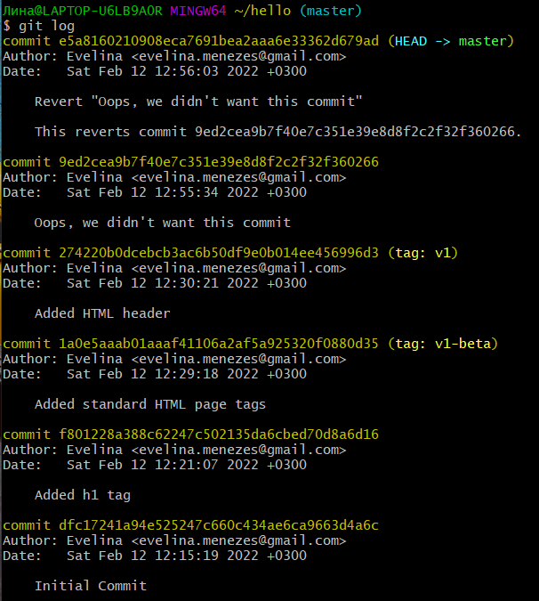

#####  **1.8 Удаление коммиттов из ветки**

  Несмотря на мощность команды git revert, которая позволяет отменить любые коммиты в репозиторий. При использовании команды git log в истории ветки еще видны оригинальный и «отмененный» коммиты. Однако бывают случае, когда эти записи из-за своей незначительности или по другим причинам мешают. В таком случае следует использовать команду «возврата» - git reset.

  **1.8.1 Команда git reset**

  При получении ссылки на коммит (т.е. хэш, ветка или имя тега), команда git
  reset:
  • перепишет текущую ветку, чтобы она указывала на нужный коммит;
  • опционально сбросит буферную зону для соответствия с указанным коммитом;
  • опционально сбросит рабочий каталог для соответствия с указанным коммитом.

  **1.8.2 Проверка истории**

  Если посмотреть последнюю проверку истории, видно, что два последних коммита в этой ветке — «Oops» и «Revert Oops».

  **1.8.3 Для начала отмечается ветку**

  Для проверки работы выше упомянутой команды выбираем последние два коммита в этой ветке и пометить последний коммит тегом, перед удалением, чтобы потом его можно было найти.

      git tag oops

   

  **1.8.4 Сброс коммитов к предшествующим коммиту Oops**

  Глядя на историю лога, видно, что коммит с тегом «v1» является коммитом,
  предшествующим ошибочному коммиту. Для того, чтобы сбросить ветку до этой точки можно использовать имя его тега в команде сброса. Если бы тега не было, можно было использовать хэш-значение.

      git reset --hard v1
      git log

  

 В текущий момент ветка master указывает на коммит v1, а коммитов Oops и Revert Oops в ветке уже нет. Параметр --hard указывает, что рабочий каталог должен быть обновлен в соответствии с новым head ветки.

 **1.8.5 Ничего никогда не теряется**

  Вопреки предыдущим действиям коммиты еще и на них можно даже ссылаться.
  Помните, в начале этого урока мы создали для отмененного коммита тег «oops».
  Следующая командда это доказывает.

   git log --all

  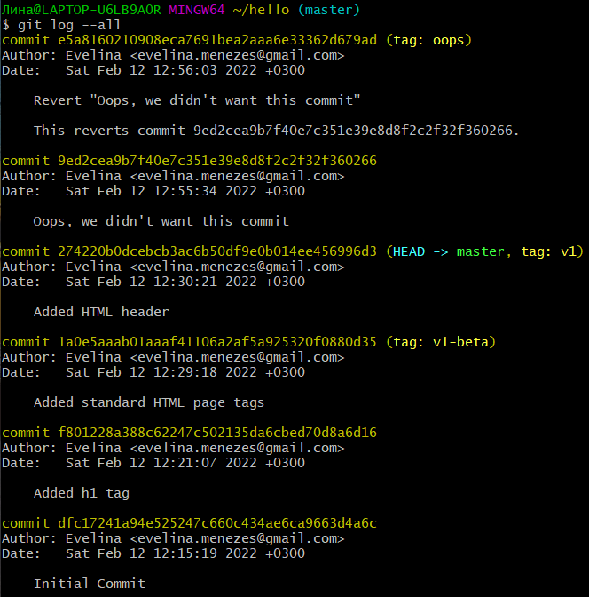

  Ошибочные коммиты просто отсутствуют в ветке master. Наличие тегов позволяет легче на них ссылаться (помощи их хэш имен). Если на коммиты нельзя ссылаться, то они остаются в репозитории до тех пор, пока не будет запущен сборщик мусора.

  **1.8.6 Опасность сброса**

  Сброс в локальных ветках, как правило, безопасен. Последствия любой «аварии» как правило, можно восстановить простым сбросом с помощью нужного коммита.
  Однако, если ветка «расшарена» на удаленных репозиториях, сброс может сбить с  толку других пользователей ветки.

#####  **1.9 Удаление тега oops**
  **1.9.1 Удаление тега oops**

Сейчас понятна важность тегов и можно продемонстрировать работу сборщика мусора.  

  git tag -d oops
  git log --all

 

 Удалился тег «oops» и коммиты, на которые он ссылался. Следовательно, он больше не отображается в репозитории.

#####  **1.10 Внесение изменений в коммиты**

  **1.10.1 Измените страницу, а затем сделайте коммит**

  Необходимо произвести следующие действия:

      <!-- Author: Dmitry S. Kulyabov -->
      <html>
      <head>
      </head>
      <body>
      <h1>Hello, World!</h1>
      </body>
      </html>

  

      git add hello.html
      git commit -m "Add an author comment"

 

**1.10.2 Необходим email**

  Допустим, что после совершения коммита становится понятным, что любой хороший комментарий должен включать электронную почту автора. Однако создание отдельного коммита слишком трудоемко для такого незначительного изменения. Существует способ просто изменить предыдущий коммит. Для демонстрации обновилась страница hello, включив в нее email.

       <!-- Author: Dmitry S. Kulyabov (kulyabov-ds@rudn.ru) -->
       <html>
       <head>
       </head>
       <body>
       <h1>Hello, World!</h1>
       </body>
       </html>

  **1.10.3 Измените предыдущий коммит**

  Изменить предыдущий коммит можно с выполнив следующие:

    git add hello.html
    git commit --amend -m "Add an author/email comment"

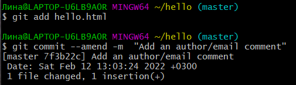

  **1.10.4 Просмотр истории**

  Выполнив *git log* можно заметить, что оригинальный коммит «автор» заменен коммитом «автор/email». Этого же эффекта можно достичь путем сброса последнего коммита в ветке, и повторного коммита новых изменений.

 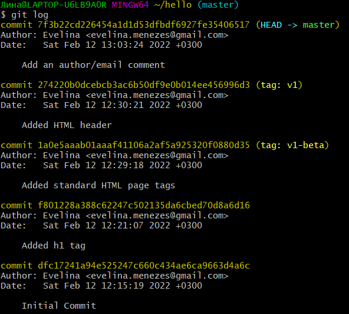

#####  **1.11 Перемещение файлов**

  **1.11.1 Переместите файл hello.html в каталог lib**

  Задание: создание структуры репозитория. Перенос страницы в каталог lib.

      mkdir lib
      git mv hello.html lib
      git status

  Перемещая файлы с помощью git mv, мы информируем git о 2 вещах:
  - Что файл hello.html был удален.
  - Что файл lib/hello.html был создан.

Оба эти факта сразу же проиндексированы и готовы к коммиту. Команда git status сообщает, что файл был перемещен.

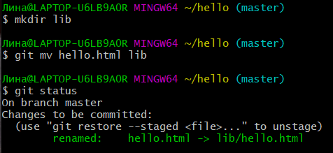

#####  **1.12 Второй способ перемещения файлов**

  Положительной чертой git является то, что можно забыть о контроле версии до того момента, пока не готовы приступить к коммиту кода. Если бы использовать командную строку операционной системы для   перемещения файлов вместо команды git, то работы будет больше, так как придется выполнить

      mkdir lib
      mv hello.html lib
      git add lib/hello.html
      git rm hello.html

**1.12.1 Коммит в новый каталог**

  Используя *git commit -m "Moved hello.html to lib"* сделали коммит этого перемещения.

 

#####  **1.13 Подробнее о структуре**

**1.13.1 Добавление index.html**

  Добавляется  файл index.html в репозиторий.

     <html>
     <body>
     <iframe src="lib/hello.html" width="200" height="200" />
     </body>
     </html>

  А затем его коммит.

      git add index.html
      git commit -m "Added index.html."

  

  Теперь при открытии index.html, виден кусок страницы hello в маленьком окошке.

 

#####  **1.14 Git внутри: Каталог .git**

  **1.14.1 Каталог .git**

  При выполнении команды *ls -C .git* видна вся информация git, которая в нем хранится.

  **1.14.2 База данных объектов**

      ls -C .git/objects

  Возникает набор каталогов, имена которых состоят из 2 символов. Имена каталогов являются первыми двумя буквами хэша sha1 объекта, хранящегося в git.

  **1.14.3 Углубляемся в базу данных объектов**

        ls -C .git/objects/<dir>

  Смотрим в один из каталогов с именем из 2 букв. Видны файлы с именами из 38 символов. Это файлы, содержащие объекты, хранящиеся в git. Они сжаты и закодированы.

 

  **1.14.4 Config File**

       cat .git/config

  

  Это файл конфигурации, создающийся для каждого конкретного проекта. Записи
  в этом файле будут перезаписывать записи в файле .gitconfi главного
  каталога, по крайней мере в рамках этого проекта.

  **1.14.5 Ветки и теги**

        ls .git/refs
        ls .git/refs/heads
        ls .git/refs/tags
        cat .git/refs/tags/v1

Каждый файл соответствует тегу, ранее созданному с помощью команды git tag. Его содержание — это всего лишь хэш коммита, привязанный к тегу. Каталог heads практически аналогичен, но используется для веток, а не тегов. На данный момент есть только одна ветка, так что все, что вы увидите в этом каталоге – это ветка master.

 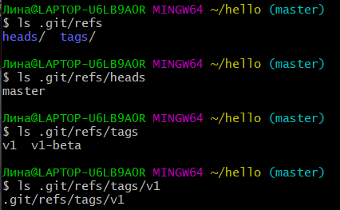

  **1.14.6 Файл HEAD**

        cat .git/HEAD

  Файл HEAD содержит ссылку на текущую ветку, в данный момент это ветка master.

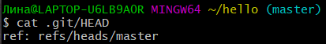

#####  **1.15 Работа непосредственно с объектами git**

  **1.15.1 Поиск последнего коммита**

  git log --max-count=1

  Эта команда должна показать последний коммит в репозиторий.

  **1.15.2 Вывод последнего коммита с помощью SHA1 хэша**

  git cat-file -t <hash>
  git cat-file -p <hash>

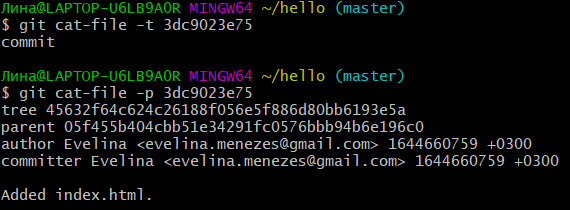

  **1.15.3 Поиск дерева**

  Можно вывести дерево каталогов, ссылка на который идет в коммите. Это должно быть описание файлов (верхнего уровня) в нашем проекте (для конкретного коммита). Использовался хэш из строки «дерева», из списка выше.

          git cat-file -p <treehash>

  **1.15.4 Вывод каталога lib**

        git cat-file -p <libhash>

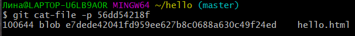

  **1.15.5 Вывод файла hello.html**

        git cat-file -p <hellohash>

  **1.15.6 Исследуйте самостоятельно**

  Исследуйте git репозиторий вручную самостоятельно. Можно найти оригинальный файл hello.html с самого первого коммита по ссылкам SHA1 хэша в последнем коммите. Для этого использовался хэш предшествующего коммита.

 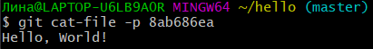

#####  **1.16 Создание ветки**

  hello world можно сделать более выразительным. Так как это занимает некоторое время, эти изменения переместились в отдельную ветку, где они изолированы от в ветки master.

  **1.16.1 Создайте ветку**

  Создается новая ветка «style»:

        git checkout -b style
        git status

  *git checkout -b <имя_ветки>* является шорткатом для git branch <имя_ветки> за которым идет git checkout <имя_ветки>. После выполнения команды git status сообщает о том, что текущая ветка - «style».

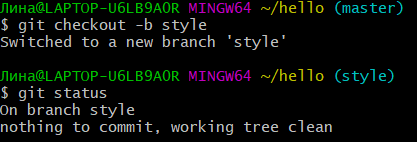

  **1.16.2 Добавьте файл стилей style.css**

         touch lib/style.css

  Файл lib/style.css:

        h1 {
        color: red;
        }

        git add lib/style.css
        git commit -m "Added css stylesheet"

   

  **1.16.3 Измените основную страницу**

  Обновляется файл hello.html, чтобы использовать стили style.css.

         <!-- Author: Dmitry S. Kulyabov (kulyabov-ds@rudn.ru) -->
         <html>
         <head>
         <link type="text/css" rel="stylesheet"
         media="all" href="style.css" />

         </head>
         <body>
         <h1>Hello, World!</h1>
         </body>
         </html>

      git add lib/hello.html
      git commit -m "Hello uses style.css"

**1.16.4 Измените index.html**

  Обновляется файл index.html, чтобы он тоже использовал style.css

          <html>
          <head>
          <link type="text/css" rel="stylesheet"
          media="all" href="lib/style.css" />
          </head>
          <body>
          <iframe src="lib/hello.html" width="200" height="200" />
          </body>
          </html>

          git add index.html
          git commit -m "Updated index.html"

#####  **1.17 Навигация по веткам**

  Теперь в проекте есть две ветки, master и style:

      git log --all

**1.17.1 Переключение на ветку master**

  Для переключения между ветками используется команда git checkout:

            git checkout master
            cat lib/hello.html

  Сейчас мы находимся на ветке master. Это заметно по тому, что файл hello.html не использует стили style.css.

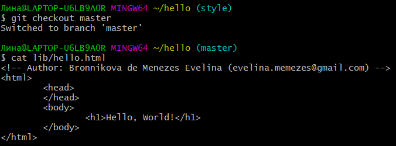

  **1.17.2 Вернемся к ветке style**

        git checkout style
        cat lib/hello.html

  Содержимое lib/hello.html подтверждает, что вернулись на ветку style.

   

#####  **1.18 Изменения в ветке master**

**1.18.1 Создайте файл README в ветке master**

        git checkout master
        Создайте файл README.md
        echo "This is the Hello World example from the git tutorial." > README.md

  

#####  **1.19 Сделайте коммит изменений README.md в ветку master.**

        git add README.md
        git commit -m "Added README"

**1.19.1 Просмотр отличающихся веток** и **1.19.2 Просмотрите текущие ветки**

  Теперь в репозитории есть две отличающиеся ветки. Используя следующую можно просмотреть ветки и их отличия.

            git log --graph --all

 

  Добавление опции --graph в git log вызывает построение дерева коммитов с помощью простых ASCII символов. Видны обе ветки (style и master), и то, что ветка master является текущей HEAD. Общим предшественником обеих веток является коммит «Added index.html». Опция --all гарантированно означает, что видны все ветки. По умолчанию показывается только текущая ветка.

 

#####  **1.20 Слияние**

**1.20.1 Слияние веток**

Слияние переносит изменения из двух веток в одну. Чтобы это проверить вернемся к ветке style и сольем master с style.

        git checkout style
        git merge master
        git log --graph --all

  Путем периодического слияния ветки master с веткой style можно переносить из master любые изменения и поддерживать совместимость изменений style с изменениями в основной ветке.

  
  
#####  **1.21 Создание конфликта**

**1.21.1 Вернитесь в master и создайте конфликт**

 Могут возникнуть ситуации, когда изменения в одной ветке конфликтуют с изменениями в другой. Чтобы ознакомится с этим случаем создается конфликт между изменениями ветки master конфликтуют и style.
Возвращаемся в ветку master и вносим следующие изменения:

           git checkout master

    Файл lib/hello.html

           <!-- Author: Dmitry S. Kulyabov (dskulyabov@rudn.ru) -->
           <html>
           <head>
           <!-- no style -->
           </head>
           <body>
           <h1>Hello, World! Life is great!</h1>
           </body>
           </html>

    git add lib/hello.html
    git commit -m 'Life is great'

  
  

**1.21.2 Просмотр веток**

           git log --graph --all

   

После коммита «Added README» ветка master была объединена с веткой style, но в настоящее время в master есть дополнительный коммит, который не был слит с style. Последнее изменение в master конфликтует с некоторыми изменениями в style. На следующем шаге мы решим этот конфликт.

#####  **1.22 Разрешение конфликтов**

**1.22.1 Слияние master с веткой style**

Теперь вернемся к ветке style и попытаемся объединить ее с новой веткой master.

  git checkout style
  git merge master
  Если открыть lib/hello.html, видно:

       <!-- Author: Dmitry S. Kulyabov (dskulyabov@rudn.ru) -->
       <html>
       <head>
       <<<<<<< HEAD
       <link type="text/css" rel="stylesheet" media="all" href="style.css" />
       =======
       <!-- no style -->
       >>>>>>> master
       </head>
       <body>
       <h1>Hello,World! Life is great!</h1>
       </body>
       </html>

   
  

  Первый раздел — версия текущей ветки (style). Второй раздел — версия ветки
  master.

  **1.22.2 Решение конфликта**

  Необходимо вручную разрешить конфликт, путем изменения lib/hello.html для достижения следующего результата.

       <!-- Author: Dmitry S. Kulyabov (dskulyabov@rudn.ru) -->
       <html>
       <head>
       <link type="text/css" rel="stylesheet"
       media="all" href="style.css" />
       </head>
       <body>
       <h1>Hello, World! Life is great!</h1>
       </body>
       </html>

   

  **1.22.3 Сделайте коммит решения конфликта**

      git add lib/hello.html
      git commit -m "Merged master fixed conflict."

   

  **1.22.4 Перебазирование как альтернатива слиянию**

  Рассмотрим различия между слиянием и перебазированием. Для того, чтобы это сделать, нужно вернуться в репозиторий в момент до первого слияния, а затем  повторить те же действия, но с использованием перебазирования вместо слияния. Мы будем использовать команду reset для возврата веток к предыдущему состоянию.

#####  **1.23 Сброс ветки style**

  **1.23.1 Сброс ветки style**

Вернемся на ветке style к точке перед тем, как мы слили ее с веткой master. Мы можем сбросить ветку к любому коммиту. По сути, это изменение указателя ветки на любую точку дерева коммитов. В этом случае мы хотим вернуться в ветке style в точку перед слиянием с master. Нам необходимо найти последний коммит перед слиянием.

    git checkout style
    git log --graph

 

 Мы видим, что коммит «Updated index.html» был последним на ветке style перед слиянием. Давайте сбросим ветку style к этому коммиту.

       git reset --hard <hash>

  **1.23.2 Проверьте ветку.**

Если поискать лог ветки style, можно заметить, что в истории больше нет коммитов слияний.

        git log --graph --all

 

#####  **1.24 Сброс ветки master**

  1.24.1 Сброс ветки master

  Добавив интерактивный режим в ветку master, мы внесли изменения, конфликтующие с изменениями в ветке style. Давайте вернемся в ветке master в точку перед внесением конфликтующих изменений. Это позволяет нам продемонстрировать работу команды git rebase, не беспокоясь о конфликтах.

         git checkout master
         git log --graph

  Коммит «Added README» идет непосредственно перед коммитом конфликтующего интерактивного режима. Мы сбросим ветку master к коммиту «Added README».

        git reset --hard <hash>
        git log --graph --all

  При просмотре лог выглядит, как будто репозиторий был перемотан назад во времени к точке до какого-либо слияния.

#####  **1.25 Перебазирование**

Используем команду rebase вместо команды merge. Мы вернулись в точку до первого слияния и хотим перенести изменения из ветки master в нашу ветку style. На этот раз для переноса изменений из ветки master мы будем использовать команду git rebase вместо слияния.

                 git checkout style
                 git rebase master
                 git log --graph

**1.25.1 Слияние VS перебазирование**

Конечный результат перебазирования очень похож на результат слияния. Ветка  style в настоящее время содержит все свои изменения, а также все изменения ветки master. Однако, дерево коммитов значительно отличается. Дерево коммитов ветки style было переписано таким образом, что ветка master является частью истории коммитов. Это делает цепь коммитов линейной и гораздо более читабельной.
Перебазирование не следует использовать:
  - если ветка является публичной и расшаренной, поскольку переписывание общих веток будет мешать работе других членов команды;
  - когда важна точная история коммитов ветки, так как команда rebase переписывает историю коммитов;

 Учитывая приведенные выше рекомендации, рекомендуется использовать git rebase для кратковременных, локальных веток, а слияние для веток в публичном репозитории.

#####  **1.26 Слияние в ветку master**

  Мы поддерживали соответствие ветки style с веткой master (с помощью rebase),теперь давайте сольем изменения style в ветку master.

**1.26.1 Слияние style в master**

       git checkout master
       git merge style

Поскольку последний коммит ветки master прямо предшествует последнему коммиту ветки style, git может выполнить ускоренное слияние-перемотку. При быстрой перемотке вперед git просто передвигает указатель вперед, таким образом указывая на тот же коммит, что и ветка style. При быстрой перемотке конфликтов быть не может.

**1.26.2 Просмотрите логи**

      git log

  Теперь ветки style и master идентичны.

#####  **1.27 Клонирование репозиториев**

  **1.27.1 Перейдите в рабочий каталог**

 Переход в рабочий каталог и сдоздание клона репозитория hello.

        cd ..
        pwd
        ls

  Сейчас мы находимся в рабочем каталоге. Здесь должен быть единственный репозиторий под названием «hello».

**1.27.2 Создайте клон репозитория hello**

  Создание клона репозитория с помощью команд:

        git clone hello cloned_hello
        ls

  В вашем рабочем каталоге теперь два репозитория: оригинальный репозиторий «hello» и клонированный репозиторий «cloned_hello».

   

#####  **1.28 Просмотр клонированного репозитория**

  **1.28.1 Давайте взглянем на клонированный репозиторий.**

        cd cloned_hello
        ls

  Виден список всех файлов на верхнем уровне оригинального репозитория: README.md, index.html и lib.

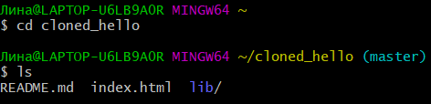

  **1.28.2 Просмотрите историю репозитория**

         git log --all

  Можно увидеть список всех коммитов в новый репозиторий, и он более или менее совпадает с историей коммитов в оригинальном репозитории. Это можно проверить, посмотрев на предыдущие пункты. Единственная разница в названиях веток.

 

**1.28.3 Удаленные ветки**

  Помимо выше упомянотого можно увидеть ветку master (HEAD) в списке истории и ветки origin/master, origin/style и origin/HEAD.

#####  **1.29 Что такое origin?**

             git remote

  Мы видим, что клонированный репозиторий знает об имени по умолчанию удаленного репозитория. Давайте посмотрим, можем ли мы получить более подробную информацию об имени по умолчанию:

         git remote show origin

  Удаленные репозитории обычно размещаются на отдельной машине, возможно, централизованном сервере. Однако, как мы видим здесь, они могут с тем же успехом указывать на репозиторий на той же машине. Название «origin» обычно используется в качестве имени первичного централизованного репозитория (если таковой имеется).

#####  **1.30 Удаленные ветки**

  Давайте посмотрим на ветки, доступные в нашем клонированном репозитории.

         git branch

  Как мы видим, в списке только ветка master. Ветка style не видна, так как команда git branch по умолчанию выводит только список локальных веток.

**1.30.1 Список удаленных веток**

Для того, чтобы увидеть все ветки, используем следующую команду:

         git branch -a

  Git выводит все коммиты в оригинальный репозиторий, но ветки в удаленном репозитории не рассматриваются как локальные. Если мы хотим собственную ветку style, мы должны сами ее создать.

  **1.31 Изменение оригинального репозитория**

  Внесите некоторые изменения в оригинальный репозиторий, чтобы затем попытаться извлечь и слить изменения из удаленной ветки в текущую

**1.31.1 Внесите изменения в оригинальный репозиторий hello**

           cd ../hello

  Примечание: Сейчас мы находимся в репозитории hello

 

  Внесите следующие изменения в файл README.md:
  Файл README.md

          This is the Hello World example from the git tutorial.

  

  Теперь добавьте это изменение и сделайте коммит:

          git add README
          git commit -m "Changed README in original repo"

  Теперь в оригинальном репозитории есть более поздние изменения, которых нет в клонированной версии. Далее мы извлечем и сольем эти изменения в клонированный репозиторий.

  

  **1.31.2 Извлечение изменений**

 В данном задании цель научиться извлекать изменения из удаленного репозитория.

             cd ../cloned_hello
             git fetch
             git log --all

  Сейчас мы находимся в репозитории cloned_hello. На данный момент в репозитории есть все коммиты из оригинального репозитория, но они не интегрированы в локальные ветки клонированного репозитория. В истории выше можно найти коммит «Changed README in original repo». Коммит включает в себя коммиты «origin/master» и «origin/HEAD». Если посмотрим на коммит «Updated index.html». Увидим, что локальная ветка master указывает на этот коммит, а не на новый коммит, который мы только что извлекли. Выводом является то, что команда git fetch будет извлекать новые коммиты из удаленного репозитория, но не будет сливать их с вашими наработками в локальных ветках.

  

  **1.31.3 Проверьте README.md**

  Можно продемонстрировать, что клонированный файл README.md не изменился.

         cat README

  

#####  **1.32 Слияние извлеченных изменений**

**1.32.1 Слейте извлеченные изменения в локальную ветку master**

        git merge origin/master

**1.32.2 Еще раз проверьте файл README.md**

  Сейчас возможно увидеть изменения и сравнить с предыдущим результатом.

         cat README.md

  Хотя команда git fetch не сливает изменения, можно вручную слить изменения из удаленного репозитория.
  Теперь давайте рассмотрим объединение fetch и merge в одну команду.

          git pull

  эквивалентно двум следующим шагам:

    git fetch
    git merge origin/master

  

#####  **1.33 Добавление ветки наблюдения**

Ветки, которые начинаются с remotes/origin являются ветками оригинального репозитория. Обратите внимание, что у вас больше нет ветки под названием style, но система контроля версий знает, что в оригинальном репозитории ветка style была.

**1.33.1 Добавьте локальную ветку, которая отслеживает удаленную ветку**

          git branch --track style origin/style
          git branch -a
          git log --max-count=2

  

  Теперь видна ветка *style* в списке веток и логе.

#####  **1.34 Чистые репозитории**

  Чистые репозитории (без рабочих каталогов) обычно используются для расшаривания. Обычный git-репозиторий подразумевает, что вы будете использовать его как рабочую директорию, поэтому вместе с файлами проекта в актуальной версии, git хранит все служебные, «чисто-репозиториевские» файлы в поддиректории .git. В удаленных репозиториях нет смысла хранить рабочие файлы на диске (как это делается в рабочих копиях), а все что им действительно нужно — это дельты изменений и другие бинарные данные репозитория. Вот это и есть «чистый репозиторий».

#####  **1.35 Создайте чистый репозиторий**

             cd ..
             git clone --bare hello hello.git
             ls hello.git

  Как правило, репозитории, оканчивающиеся на .git являются чистыми репозиториями.

  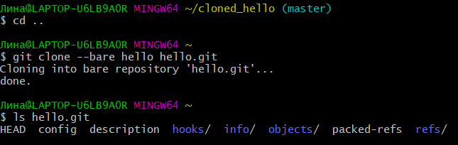

#####  **1.36 Добавление удаленного репозитория**
  Добавление репозиторий *hello.git* к оригинальному репозиторию.

            cd hello
            git remote add shared ../hello.git

  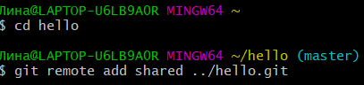

#####  **1.37 Отправка изменений**

  По причине расшаривания чистых репозитории, как правило, в сетевых серверах, необходимо отправить наши изменения в другие репозитории. Для этого создается изменения для отправки, редактируйтся файл *README.md* и делайтся коммит.

  Файл README.md:

           *This is the Hello World example from the git tutorial.*

           *(Changed in the original and pushed to shared)*

           git checkout master
           git add README
           git commit -m "Added shared comment to readme"

  Далее изменения отправляется в репозиторий, получающий отправленные нами изменения -общий репозиторий.

        git push shared master

#####   **1.38 Извлечение общих изменений**

  Переключение в клонированный репозиторий и извлечение изменений, только что отправленных в общий репозиторий.

          cd ../cloned_hello

          git remote add shared ../hello.git
          git branch --track shared master
          git pull shared master
          cat README.md

##### ВЫВОД
В ходе выполнения работы были приобретены практические навыки работы с git.
