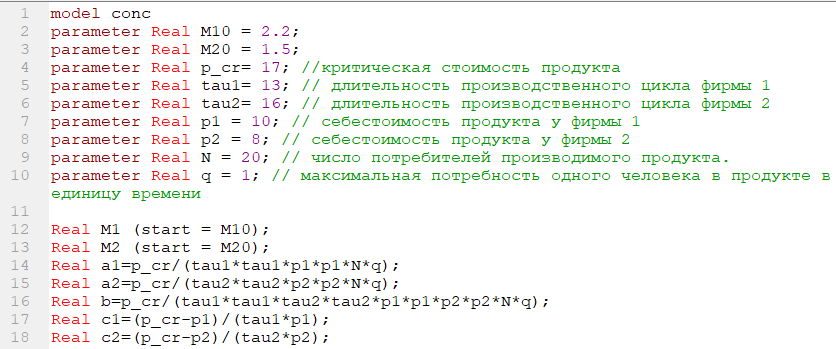
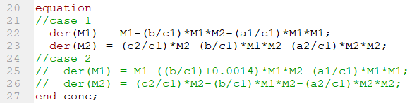
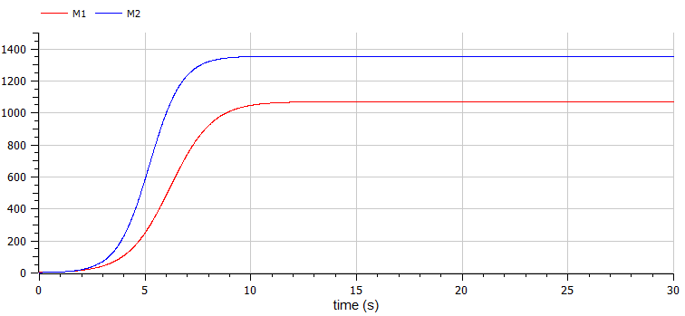
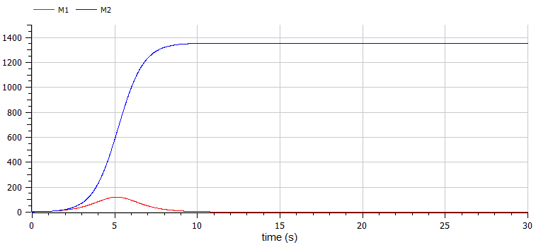

# **Презентация по лабораторной работе №8**

**Модель конкуренции двух фирм**
&nbsp;
&nbsp;

Студентка: Бронникова Де Менезеш Эвелина

Группа: НФИбд-01-19

---

# Цель 

&nbsp;
Ознакомиться с математической моделью конкуренции двух фирм, используя программу OpenModelica. 

---

# Прагматика выполнения

**Модель конкуренции двух фирм**
&nbsp;
Математическая модель конкуренции двух фирм для 2 случаев:

1.
$\frac{dM_1}{d\theta}=M_1-\frac{b}{c_1}M_1M_2-\frac{a_1}{c_1}M_1^2$

$\frac{dM_2}{d\theta}=\frac{c_2}{c_1}M_2-\frac{b}{c_1}M_1M_2-\frac{a_2}{c_1}M_2^2$

2.
$\frac{dM_1}{d\theta}=M_1-(\frac{b}{c_1}+х)M_1M_2-\frac{a_1}{c_1}M_1^2$

$\frac{dM_2}{d\theta}=\frac{c_2}{c_1}M_2-\frac{b}{c_1}M_1M_2-\frac{a_2}{c_1}M_2^2$

---

# Задачи

1. Постройте графики изменения оборотных средств фирмы 1 и фирмы 2 без учета постоянных издержек и с веденной нормировкой для случая 1.
2. Постройте графики изменения оборотных средств фирмы 1 и фирмы 2 без учета постоянных издержек и с веденной нормировкой для случая 2.

Случай 1.

$\frac{dM_1}{d\theta}=M_1-\frac{b}{c_1}M_1M_2-\frac{a_1}{c_1}M_1^2$
$\frac{dM_2}{d\theta}=\frac{c_2}{c_1}M_2-\frac{b}{c_1}M_1M_2-\frac{a_2}{c_1}M_2^2$

Случай 2.

$\frac{dM_1}{d\theta}=M_1-(\frac{b}{c_1}+0,0014)M_1M_2-\frac{a_1}{c_1}M_1^2$
$\frac{dM_2}{d\theta}=\frac{c_2}{c_1}M_2-\frac{b}{c_1}M_1M_2-\frac{a_2}{c_1}M_2^2$

---

Для обоих случаев рассмотрим задачу со следующими начальными условиями и параметрами: 
$M_0^1=2.2$, $M_0^2=1.5$, 
$p_{cr}=17$,$N=20$, $q=1$
$\tau_1=13$, $\tau_2=16$, 
$\tilde{p_1}=10$, $\tilde{p_2}=8$

где $a_1=\frac{p_{cr}}{\tau_1^2\tilde{p_1^2}Nq}$, $a_2=\frac{p_{cr}}{\tau_2^2\tilde{p_2^2}Nq}$, $b=\frac{p_{cr}}{\tau_1^2\tilde{p_1^2}\tau_2^2\tilde{p_2^2}Nq}$, $c_1=\frac{p_{cr}-\tilde{p_1}}{\tau_1\tilde{p_1}}$, $c_2=\frac{p_{cr}-\tilde{p_2}}{\tau_2\tilde{p_2}}$.

Также введена нормировка $t=c_1\theta$.

---
# Результаты выполнения

1. Написание программы с необходимыми условиями в OpenModelica

---

- 1. Построение графика изменения оборотных средств фирмы 1 и фирмы 2 без учета постоянных издержек и с веденной нормировкой для случая 1.

---

- 2. Построение графика изменения оборотных средств фирмы 1 и фирмы 2 без учета постоянных издержек и с веденной нормировкой для случая 2.

---

# Выводы

В ходе выполнения данной лабораторной работы была построена модель конкуренции двух фирм, используя программу OpenModelica. 
В частности, построились графики изменения оборотных средств фирмы 1 и фирмы 2 без учета постоянных издержек и с веденной нормировкой для случая 1 и 2.

