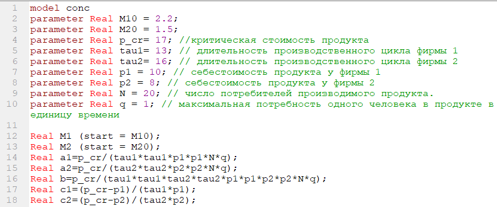
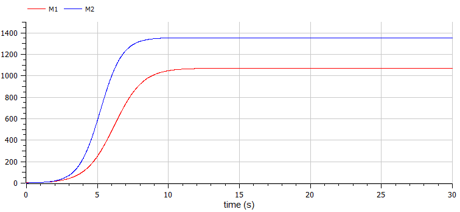

---
# Front matter
title: "Отчёт по лабораторной работе №8"
subtitle: "Вариант 5"
author: "Бронникова де Менезеш Эвелина"

# Generic options
lang: ru-RU
toc-title: "Содержание"

# Bibliography
bibliography: bib/cite.bib
csl: pandoc/csl/gost-r-7-0-5-2008-numeric.csl

# Pdf output format
toc: true # Table of contents
toc_depth: 2
lof: true # List of figures
lot: true # List of tables
fontsize: 12pt
linestretch: 1.5
papersize: a4
documentclass: scrreprt
## I18n
polyglossia-lang:
  name: russian
  options:
    - spelling=modern
    - babelshorthands=true
polyglossia-otherlangs:
  name: english
### Fonts
mainfont: PT Serif
romanfont: PT Serif
sansfont: PT Sans
monofont: PT Mono
mainfontoptions: Ligatures=TeX
romanfontoptions: Ligatures=TeX
sansfontoptions: Ligatures=TeX,Scale=MatchLowercase
monofontoptions: Scale=MatchLowercase,Scale=0.9
## Biblatex
biblatex: true
biblio-style: "gost-numeric"
biblatexoptions:
  - parentracker=true
  - backend=biber
  - hyperref=auto
  - language=auto
  - autolang=other*
  - citestyle=gost-numeric
## Misc options
indent: true
header-includes:
  - \linepenalty=10 # the penalty added to the badness of each line within a paragraph (no associated penalty node) Increasing the value makes tex try to have fewer lines in the paragraph.
  - \interlinepenalty=0 # value of the penalty (node) added after each line of a paragraph.
  - \hyphenpenalty=50 # the penalty for line breaking at an automatically inserted hyphen
  - \exhyphenpenalty=50 # the penalty for line breaking at an explicit hyphen
  - \binoppenalty=700 # the penalty for breaking a line at a binary operator
  - \relpenalty=500 # the penalty for breaking a line at a relation
  - \clubpenalty=150 # extra penalty for breaking after first line of a paragraph
  - \widowpenalty=150 # extra penalty for breaking before last line of a paragraph
  - \displaywidowpenalty=50 # extra penalty for breaking before last line before a display math
  - \brokenpenalty=100 # extra penalty for page breaking after a hyphenated line
  - \predisplaypenalty=10000 # penalty for breaking before a display
  - \postdisplaypenalty=0 # penalty for breaking after a display
  - \floatingpenalty = 20000 # penalty for splitting an insertion (can only be split footnote in standard LaTeX)
  - \raggedbottom # or \flushbottom
  - \usepackage{float} # keep figures where there are in the text
  - \floatplacement{figure}{H} # keep figures where there are in the text
---
# Цель работы

Ознакомиться с моделью конкуренции двух фирм, используя программу OpenModelica.

# Задание

**Случай 1**. Рассмотрим две фирмы, производящие взаимозаменяемые товары одинакового качества и находящиеся в одной рыночной нише. Считаем, что в рамках нашей модели конкурентная борьба ведётся только рыночными методами. То есть, конкуренты могут влиять на противника путем изменения параметров своего производства: себестоимость, время цикла, но не могут прямо вмешиваться в ситуацию на рынке («назначать» цену или влиять на потребителей каким-либо иным способом.) Будем считать, что постоянные издержки пренебрежимо малы, и в модели учитывать не будем. В этом случае динамика изменения объемов продаж фирмы 1 и фирмы 2 описывается следующей системой уравнений:

$\frac{dM_1}{d\theta}=M_1-\frac{b}{c_1}M_1M_2-\frac{a_1}{c_1}M_1^2$

$\frac{dM_2}{d\theta}=\frac{c_2}{c_1}M_2-\frac{b}{c_1}M_1M_2-\frac{a_2}{c_1}M_2^2$

где $a_1=\frac{p_{cr}}{\tau_1^2\tilde{p_1^2}Nq}$, $a_2=\frac{p_{cr}}{\tau_2^2\tilde{p_2^2}Nq}$, $b=\frac{p_{cr}}{\tau_1^2\tilde{p_1^2}\tau_2^2\tilde{p_2^2}Nq}$, $c_1=\frac{p_{cr}-\tilde{p_1}}{\tau_1\tilde{p_1}}$, $c_2=\frac{p_{cr}-\tilde{p_2}}{\tau_2\tilde{p_2}}$.

Также введена нормировка $t=c_1\theta$.

**Случай 2**. Рассмотрим модель, когда, помимо экономического фактора влияния (изменение себестоимости, производственного цикла, использование кредита и т.п.), используются еще и социально-психологические факторы – формирование общественного предпочтения одного товара другому, не зависимо от их качества и цены. В этом случае взаимодействие двух фирм будет зависеть друг от друга, соответственно коэффициент перед $M_1M_2$ будет отличаться. Пусть в рамках рассматриваемой модели динамика изменения объемов продаж фирмы 1 и фирмы 2 описывается следующей системой уравнений:

$\frac{dM_1}{d\theta}=M_1-(\frac{b}{c_1}+0,0014)M_1M_2-\frac{a_1}{c_1}M_1^2$

$\frac{dM_2}{d\theta}=\frac{c_2}{c_1}M_2-\frac{b}{c_1}M_1M_2-\frac{a_2}{c_1}M_2^2$

Для обоих случаев рассмотрим задачу со следующими начальными условиями и параметрами: 
$M_0^1=2.2$, $M_0^2=1.5$, 
$p_{cr}=17$,$N=20$, $q=1$
$\tau_1=13$, $\tau_2=16$, 
$\tilde{p_1}=10$, $\tilde{p_2}=8$

_**Замечание:**_ Значения $p_{cr}, \tilde{p_{1,2}},N$ указаны в тысячах единиц, а значения $M_{1,2}$ указаны в млн. единиц.

_**Обозначения:**_
$N$ – число потребителей производимого продукта.
$\tau$ - длительность производственного цикла
$p$ -  рыночная цена товара
$\tilde{p}$ -  себестоимость продукта, то есть переменные издержки на производство единицы продукции.
$q$ -  максимальная потребность одного человека в продукте в единицу времени
$\theta=\frac{t}{c_1}$ -  безразмерное время

1. Постройте графики изменения оборотных средств фирмы 1 и фирмы 2 без учета постоянных издержек и с веденной нормировкой для случая 1.
2. Постройте графики изменения оборотных средств фирмы 1 и фирмы 2 без учета постоянных издержек и с веденной нормировкой для случая 2.[^1]

[^1]:[Кулябов Д.С. Задания к лабораторной работе № 8 (по вариантам). - 106 c.](https://esystem.rudn.ru/mod/resource/view.php?id=831132)

# Теоретическое введение

## **Модель конкуренции двух фирм**

**Модель одной фирмы**
Для построения модели конкуренции хотя бы двух фирм необходимо рассмотреть модель одной фирмы. Вначале рассмотрим модель фирмы, производящей продукт долговременного пользования, когда цена его определяется балансом спроса и предложения. Примем, что этот продукт занимает определенную нишу рынка и конкуренты в ней отсутствуют.
Обозначим:
$N$ – число потребителей производимого продукта.
$S$ – доходы потребителей данного продукта. Считаем, что доходы всех потребителей одинаковы. Это предположение справедливо, если речь идет об одной рыночной нише, т.е. производимый продукт ориентирован на определенный слой населения. 
$M$ – оборотные средства предприятия
$\tau$ - длительность производственного цикла
$p$ -  рыночная цена товара
$\tilde{p}$ -  себестоимость продукта, то есть переменные издержки на производство единицы продукции.
$\delta$ – доля оборотных средств, идущая на покрытие переменных издержек.
$k$ – постоянные издержки, которые не зависят от количества выпускаемой 
продукции.

$Q(S/p)$ – функция спроса, зависящая от отношения дохода $S$ к цене $p$. Она равна количеству продукта, потребляемого одним потребителем в единицу времени.
Функцию спроса товаров долговременного использования часто представляют в простейшей форме:

$$
\begin{equation}
Q=q-k\frac{p}{S}=q(1-\frac{p}{p_{cr}})
\end{equation}
$$

где $q$ – максимальная потребность одного человека в продукте в единицу времени. Эта функция падает с ростом цены и при $p = p_{cr}$ (критическая стоимость продукта) потребители отказываются от приобретения товара. Величина $p_{cr} = Sq/k$. Параметр $k$ – мера эластичности функции спроса по цене. Таким образом, функция спроса в форме (1) является пороговой (то есть, $Q(S/p)$ = 0 при $p ≥ p_{cr}$) и обладает свойствами насыщения.
Уравнения динамики оборотных средств можно записать в виде

$$
\begin{equation}
\frac{dM}{dt}=-\frac{M\delta}{\tau}+NQp-k=-\frac{M\delta}{\tau}+Nq(1-\frac{p}{p_{cr}})p-k
\end{equation}
$$ 

Уравнение для рыночной цены p представим в виде

$$
\begin{equation}
\frac{dp}{dt}=\gamma(-\frac{M\delta}{\tau\tilde{p}}+Nq(1-\frac{p}{p_{cr}}))
\end{equation}
$$ 

Первый член соответствует количеству поставляемого на рынок товара (то есть, предложению), а второй член – спросу.
Параметр $\gamma$ зависит от скорости оборота товаров на рынке. Как правило, время торгового оборота существенно меньше времени производственного цикла $\tau$. При заданном $M$ уравнение (3) описывает быстрое стремление цены к равновесному значению цены, которое устойчиво.
В этом случае уравнение (3) можно заменить алгебраическим соотношением

$$
\begin{equation}
-\frac{M\delta}{\tau\tilde{p}}+Nq(1-\frac{p}{p_{cr}})=0
\end{equation}
$$ 

Из (4) следует, что равновесное значение цены p равно

$$
\begin{equation}
p=p_{cr}(1-\frac{M\delta}{\tau\tilde{p}Nq})
\end{equation}
$$

Уравнение (2) с учетом (5) приобретает вид

$$
\begin{equation}
\frac{dM}{dt}=M\frac{\delta}{\tau}(\frac{p_{cr}}{\tilde{p}}-1)-M^2(\frac{\delta}{\tau\tilde{p}) Nq})^2\frac{p_{cr}}{Nq}-k
\end{equation}
$$

Уравнение (6) имеет два стационарных решения, соответствующих условию $dM/dt$ = 0:

$$
\begin{equation}
\tilde{M_{1,2}}=\frac{1}{2}a\pm\sqrt{\frac{a^2}{4}-b}
\end{equation}
$$

где

$$
\begin{equation}
a=Nq(1-\frac{\tilde{p}}{p_{cr}})\tilde{p}\frac{\tau}{\delta}, b=kNq\frac{(\tau\tilde{p})^2}{p_{cr}\delta^2} 
\end{equation}
$$

Из (7) следует, что при больших постоянных издержках (в случае $a^2 < 4b$) стационарных состояний нет. Это означает, что в этих условиях фирма не может функционировать стабильно, то есть, терпит банкротство. Однако, как правило, постоянные затраты малы по сравнению с переменными (то есть, $b << a^2$) и играют роль, только в случае, когда оборотные средства малы. При $b << a$ стационарные 
значения $M$ равны

$$
\begin{equation}
\tilde{M_+}=Nq\frac{\tau}{\delta}(1-\frac{\tilde{p}}{p_{cr}})\tilde{p}, \tilde{M_-}=k\tilde{p}\frac{\tau}{\delta(p_{cr}\tilde{p})} 
\end{equation}
$$

Первое состояние $\tilde{M_+}$ устойчиво и соответствует стабильному 
функционированию предприятия. Второе состояние $\tilde{M_-}$ неустойчиво, так, что при $M<\tilde{M_-}$ оборотные средства падают $(dM/dt < 0)$, то есть, фирма идет к банкротству. По смыслу $\tilde{M_-}$ соответствует начальному капиталу, необходимому 
для входа в рынок.
В обсуждаемой модели параметр $\delta$ всюду входит в сочетании с $\tau$. Это значит, что уменьшение доли оборотных средств, вкладываемых в производство, эквивалентно удлинению производственного цикла. Поэтому мы в дальнейшем положим: $\delta$ = 1, а параметр $\tau$ будем считать временем цикла, с учётом сказанного.

**Конкуренция двух фирм**

_**Случай 1**_

Рассмотрим две фирмы, производящие взаимозаменяемые товары одинакового качества и находящиеся в одной рыночной нише. Последнее означает, что у потребителей в этой нише нет априорных предпочтений, и они приобретут тот или иной товар, не обращая внимания на знак фирмы. В этом случае, на рынке устанавливается единая цена, которая определяется балансом суммарного предложения и спроса. Иными словами, в рамках нашей модели конкурентная борьба ведётся только рыночными методами. То есть, конкуренты могут влиять на противника путем изменения параметров своего производства: себестоимость, время цикла, но не могут прямо вмешиваться в ситуацию на рынке («назначать» цену или влиять на потребителей каким-либо иным способом.)
Уравнения динамики оборотных средств запишем по аналогии с (2) в виде

$\frac{M_1}{dt}=-\frac{M_1}{\tau_1}+N_1q(1-\frac{p}{p_{cr}})p-k_1$

$\frac{M_2}{dt}=-\frac{M_2}{\tau_2}+N_2q(1-\frac{p}{p_{cr}})p-k_2$
$$
\begin{equation}
\end{equation}
$$

где использованы те же обозначения, а индексы 1 и 2 относятся к первой и второй фирме, соответственно. Величины $N_1$ и $N_2$ – числа потребителей, приобретших товар первой и второй фирмы. 
Учтем, что товарный баланс устанавливается быстро, то есть, произведенный каждой фирмой товар не накапливается, а реализуется по цене $p$. 
Тогда

$\frac{M_1}{\tau_1\tilde{p_1}}=N_1q(1-\frac{p}{p_{cr}})$

$\frac{M_2}{\tau_2\tilde{p_2}}=N_2q(1-\frac{p}{p_{cr}})$
$$
\begin{equation}
\end{equation}
$$

где $\tilde{p_1}$ и $\tilde{p_2}$ – себестоимости товаров в первой и второй фирме.
С учетом (10) представим (11) в виде

$\frac{dM_1}{dt}=-\frac{M_1}{\tau_1}(1-\frac{p}{\tilde{p_1}})-k_1$

$\frac{dM_2}{dt}=-\frac{M_2}{\tau_2}(1-\frac{p}{\tilde{p_2}})-k_2$
$$
\begin{equation}
\end{equation}
$$

Уравнение для цены, по аналогии с (3),

$$
\begin{equation}
\frac{dp}{dt}=-\gamma(\frac{M_1}{\tau_1\tilde{p_1}}+\frac{M_2}{\tau_2\tilde{p_2}}-Nq(1-\frac{p}{p_{cr}}))
\end{equation}
$$

Считая, как и выше, что ценовое равновесие устанавливается быстро, получим:

$$
\begin{equation}
\frac{dp}{dt}=-\gamma(\frac{M_1}{\tau_1\tilde{p_1}}+\frac{M_2}{\tau_2\tilde{p_2}}-Nq(1-\frac{p}{p_{cr}}))
\end{equation}
$$

Подставив (14) в (12) имеем:

$\frac{dM_1}{dt}=c_1M_1-bM_1M_2-a_1M_1^2-k_1$

$\frac{dM_2}{dt}=c_2M_2-bM_1M_2-a_2M_2^2-k_2$
$$
\begin{equation}
\end{equation}
$$

где

$$
\begin{equation}
a_1=\frac{p_{cr}}{\tau_1^2\tilde{p_1^2}Nq}, a_2=\frac{p_{cr}}{\tau_2^2\tilde{p_2^2}Nq}, b=\frac{p_{cr}}{\tau_1^2\tilde{p_1^2}\tau_2^2\tilde{p_2^2}Nq}, c_1=\frac{p_{cr}-\tilde{p_1}}{\tau_1\tilde{p_1}}, c_2=\frac{p_{cr}-\tilde{p_2}}{\tau_2\tilde{p_2}}
\end{equation}
$$

Исследуем систему (15) в случае, когда постоянные издержки ($κ_1, κ_2$) пренебрежимо малы. И введем нормировку $t=c_1\theta$. Получим следующую систему:

$\frac{dM_1}{d\theta}=M_1-\frac{b}{c_1}M_1M_2-\frac{a_1}{c_1}M_1^2$

$\frac{dM_2}{d\theta}=\frac{c_2}{c_1}M_2-\frac{b}{c_1}M_1M_2-\frac{a_2}{c_1}M_2^2$
$$
\begin{equation}
\end{equation}
$$

Чтобы решить систему (17) необходимо знать начальные условия. 

_**Замечание**_: Необходимо учесть, что значения $p_{cr}, \tilde{p_{1,2}}, N$ указаны в тысячах единиц (например $N=10$ - означает 10 000 потенциальных потребителей), а значения $M_{1,2}$ указаны в млн. единиц.

_**Случай 2**_
Рассмотрим модель, когда, помимо экономического фактора влияния (изменение себестоимости, производственного цикла, использование кредита и т.п.), используются еще и социально-психологические факторы – формирование общественного предпочтения одного товара другому, не зависимо от их качества и цены. В этом случае взаимодействие двух фирм будет зависеть друг от друга, соответственно коэффициент перед $M_1M_2$ будет отличаться. Пусть в рамках рассматриваемой модели динамика изменения объемов продаж фирмы 1 и фирмы 2 описывается следующей системой уравнений:

$\frac{dM_1}{d\theta}=M_1-(\frac{b}{c_1}+х)M_1M_2-\frac{a_1}{c_1}M_1^2$

$\frac{dM_2}{d\theta}=\frac{c_2}{c_1}M_2-\frac{b}{c_1}M_1M_2-\frac{a_2}{c_1}M_2^2$

$$
\begin{equation}
\end{equation}
$$

_**Замечание:**_ Стоит отметить, что рассматривается упрощенная модель, которая дает модельное решение. В реальности факторов, влияющих на динамику изменения оборотных средств предприятий, больше.[^2]

[^2]:[Кулябов Д.С. Лабораторная работа № 8. - 7 c.](https://esystem.rudn.ru/mod/resource/view.php?id=831131)

# Выполнение лабораторной работы

1. Написание программы с необходимыми условиями в OpenModelica

{#fig:001 width=70%}

{#fig:002 width=70%}

- 1. Построение графика изменения оборотных средств фирмы 1 и фирмы 2 без учета постоянных издержек и с веденной нормировкой для случая 1.

{#fig:003 width=70%}

По графику видно, что рост оборотных средств предприятий идет независимо друг от друга. Каждая фирма достигает свое максимальное значение объема продаж и остается на рынке с этим значением, то есть каждая фирма захватывает свою часть рынка потребителей, которая не изменяется. В данном случае наибольший объем продаж у фирмы 2.

- 2. Построение графика изменения оборотных средств фирмы 1 и фирмы 2 без учета постоянных издержек и с веденной нормировкой для случая 2.

{#fig:004 width=70%}

По графику видно, что также, как и в первом случае фирма 2 достигает свое максимальное значение объема продаж и остается на рынке с этим значением. Однако первая фирма, несмотря на начальный рост, достигнув своего максимального объема продаж, который является меньшим значением по сравнению с первым графиком, начинает нести убытки и, в итоге, терпит банкротство. 

# Выводы

В ходе выполнения данной лабораторной работы была построена модель конкуренции двух фирм, используя программу OpenModelica. 
В частности, построились графики изменения оборотных средств фирмы 1 и фирмы 2 без учета постоянных издержек и с веденной нормировкой для случая 1 и 2.

# Библиография

1. [Кулябов Д.С. Задания к лабораторной работе № 8 (по вариантам). - 106 c.](https://esystem.rudn.ru/mod/resource/view.php?id=831132)
2. [Кулябов Д.С. Лабораторная работа № 8. - 7 c.](https://esystem.rudn.ru/mod/resource/view.php?id=831131)
